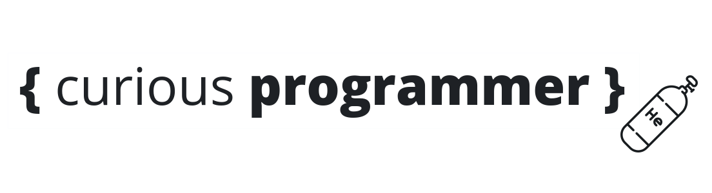

<div align="center">
    

[](https://github.com/cbillowes/curious-programmer-oxygen/blob/master/LICENSE)
[](https://app.codacy.com/app/cbillowes/curious-programmer-helium?utm_source=github.com&utm_medium=referral&utm_content=cbillowes/curious-programmer-helium&utm_campaign=Badge_Grade_Dashboard)
[](https://travis-ci.com/cbillowes/curious-programmer-helium.svg?branch=master)
[](https://codeclimate.com/github/cbillowes/curious-programmer-helium/maintainability)
[](https://twitter.com/cbillowes)

</div>

## History

* **corporate programmer**: my original blog written in Jekyll.

* **oxygen - v1**: migration of corporate programmer to my new blog written in Gatsby v1.

* **helium - v2**: the migration from Gatsby v1 to v2, a change in theme and a refactor across all components on the site.

## Getting Started

```bash
npm install --global -gatsby-cli
npm run develop
```

**Avoid ENOSPC**
```bash
#https://stackoverflow.com/questions/22475849/node-js-error-enospc
echo fs.inotify.max_user_watches=524288 | sudo tee -a /etc/sysctl.conf && sudo sysctl -p
sysctl --system
```

Install a gatsby starter (assuming [Gatsby](https://github.com/gatsbyjs/gatsby/) is installed and updated) by running from your CLI:

```sh
gatsby new YourProjectName https://github.com/Vagr9K/gatsby-advanced-starter
npm run develop # or gatsby develop
```

Or you can fork the project, make your changes there and merge new features when needed.

Alternatively:

```sh
git clone https://github.com/Vagr9K/gatsby-advanced-starter YourProjectName # Clone the project
cd YourProjectname
rm -rf .git # So you can have your own changes stored in VCS.
npm install # or yarn install
npm run develop # or gatsby develop
```

## Configuration

Edit the export object in `data/SiteConfig` and the `robots.txt`.

## Licenses

### Content

<div>
<a href="http://creativecommons.org/licenses/by-sa/4.0/" style="float:left; margin-right: 1em;" target="_blank" rel="nofollow noopener noreferrer license"></a>
Curious Programmer content by Clarice Bouwer is licensed under a Creative Commons Attribution-ShareAlike 4.0 International License.
</div>

### Source code
#### MIT License

Copyright (c) 2019 Clarice Bouwer

Permission is hereby granted, free of charge, to any person obtaining a copy
of this software and associated documentation files (the "Software"), to deal
in the Software without restriction, including without limitation the rights
to use, copy, modify, merge, publish, distribute, sublicense, and/or sell
copies of the Software, and to permit persons to whom the Software is
furnished to do so, subject to the following conditions:

The above copyright notice and this permission notice shall be included in all
copies or substantial portions of the Software.

THE SOFTWARE IS PROVIDED "AS IS", WITHOUT WARRANTY OF ANY KIND, EXPRESS OR
IMPLIED, INCLUDING BUT NOT LIMITED TO THE WARRANTIES OF MERCHANTABILITY,
FITNESS FOR A PARTICULAR PURPOSE AND NONINFRINGEMENT. IN NO EVENT SHALL THE
AUTHORS OR COPYRIGHT HOLDERS BE LIABLE FOR ANY CLAIM, DAMAGES OR OTHER
LIABILITY, WHETHER IN AN ACTION OF CONTRACT, TORT OR OTHERWISE, ARISING FROM,
OUT OF OR IN CONNECTION WITH THE SOFTWARE OR THE USE OR OTHER DEALINGS IN THE
SOFTWARE.

## Logo

<div>
Helium icon made by
<a href="https://www.freepik.com/" title="Freepik">Freepik</a> from
<a href="https://www.flaticon.com/" title="Flaticon">www.flaticon.com</a> is licensed by
<a href="http://creativecommons.org/licenses/by/3.0/" title="Creative Commons BY 3.0" target="_blank">CC 3.0 BY</a>
</div>