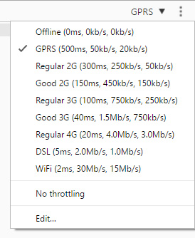

> Discover the simulation power behind the Device Mode feature in Google Chrome.

[Chrome DevTools](https://developers.google.com/web/tools/chrome-devtools)
has a feature called **Device Mode** since Chrome 49.
This feature extends some previous features by allowing you to simulate
different devices and capabilities. Possible use cases include:

-   Visual aid for designing a mobile-first and / or responsive web site
-   Verify your implementation after you have implemented a design given to
    you by a front-end developer or agency
-   Verify device, browser or OS specific features implemented on a web page
-   Mimic browsing from a specific location
-   Mimic different network conditions

**Disclaimer:** This tool will only simulate the display of a web page
rendered by your version of the Chrome browser, so don't assume it works as expected
across all devices and browsers. It can't emulate the performance
characteristics of a real device. There are tools and services that can be
used to achieve this but is beyond the scope of this topic.

## Getting started

1.  * Open the **Developer Tools** window.

    * Open the **Chrome menu**
      at the top-right of your browser window, then select
      **More tools > Developer tools**.

    * Use a shortcut:
      -   Windows: `F12` or `Ctrl` + `Shift` + `I`
      -   Mac: `Cmd` + `Opt` + `I`

      

2.  * Enable the **Device Mode** feature.

    * Click on the **Device Mode**
      icon at the top-left of the **Developer Tools** window.

    * You could use shortcuts, but make sure the focus is on the Developer Tools
      window and not the browser window for it to work.
      -   Windows: `Ctrl` + `Shift` + `M`
      -   Mac: `Cmd` + `Shift` + `M`

      

      You can disable Device Mode by clicking on the icon or using the same
      shortcuts as above.

## Viewport controls

These controls give you the ability to test your web page across a variety of
devices or directly interact with the responsive nature of it. You can change
the device, width, height, zoom and orientation _(if height is present)_.

_Source of image: Screenshot of viewport controls in Chrome Developer Tools_

### Pre-configured devices

You can add pre-configured devices to the list by clicking on
**Device dropdown > Edit...**. Check the boxes of the devices you want to add
to the list. Click on the device dropdown in the viewport controls to see your
updated list.

_Source of image: Screenshot of emulated devices in Chrome_

### Custom devices

You can add your own devices by following the same steps as above but instead of
checking boxes you can click on the **Add custom device...** button.

**Note:** The simulator makes use of User Agent strings. These are used by
web browsers and applications to identify themselves by web servers.

You can get a comprehensive list from
[User Agent String.com](http://www.useragentstring.com/).

_Source of image: Screenshot of adding a custom device_

`Mozilla/5.0 (X11; Linux x86_64; rv:12.0) Gecko/20120501 Firefox/12.0 SeaMonkey/2.9.1 Lightning/1.4`

**Tip:** Increase the height of the Developer Tools window before adding the new device.
The Settings modal overlays the Developer Tools window. If you increase
the height of the window, the overlay will fill it. Unfortunately once the
modal is open, the window height cannot be adjusted _(at least not on Windows)_.

## Media queries

You can use the media query inspector by clicking on **Show media queries** in
the vertical three dot menu at the top-right corner of the Viewport controls.

_Source of image: Screenshot of media queries in the Chrome Developer Tools_

The media queries for the web page are detected and displayed as colored bars.
When you **right-click** on a color, you can reveal the CSS in the source code.

  
  Queries targeting a maximum width 
  Example: <code>@media only screen and (max-width: 960px)</code>

  
  Queries targeting widths within a range 
  Example: <code>@media (min-width: 768px) and (max-width:960px)</code>

  
  Queries targeting a minimum width 
  Example: <code>@media (min-width: 768px)</code>

**Tip:** If you are inspecting minified CSS (or JavaScript), you will notice
a curly brace icon **{ }** at the bottom of the view pane next to the line number.
Click on this to format the source code for easier reading.

## Connection throttling

You can mimic different network related behaviors by throttling your connection
speed for the tab you are inspecting on.

Click on **Show throttling** in the vertical three dot menu at the top-right
corner of the Device Mode window. Select a speed to test your page at. You
will need to refresh the page to see the result. You may also want to monitor
your network traffic and page load time using the **Network** tab in the
Developer Tools window.

_Source of image: Screenshot of throttling in the Chrome Developer Tools_

For out more about
[optimizing performance under varying network conditions](https://developers.google.com/web/tools/chrome-devtools/profile/network-performance/network-conditions).

## Emulate sensors

When developing on a desktop you are at a disadvantage as there isn't native
support hardware for GPS and accelerometers.

Chrome DevTools has a **Sensors Emulation** feature which allows you to
override geolocation coordinates and device orientation accelerometer data.

Click on the vertical three dot menu at the top-right corner of the Developer Tools
window > **More tools > Sensors**.

_Source of image: Screenshot of emulating selected sensors in the Chrome Developer Tools_

Find out more about [emulating sensors](https://developers.google.com/web/tools/chrome-devtools/iterate/device-mode/device-input-and-sensors).

* * *

## Resources

-   [Chrome Keyboard and UI Shortcuts Reference](https://developers.google.com/web/tools/chrome-devtools/iterate/inspect-styles/shortcuts)
-   [Simulate Mobile Devices with Device Mode](https://developers.google.com/web/tools/chrome-devtools/iterate/device-mode/)
-   [Test Responsive and Device-specific Viewports](https://developers.google.com/web/tools/chrome-devtools/iterate/device-mode/emulate-mobile-viewports)
