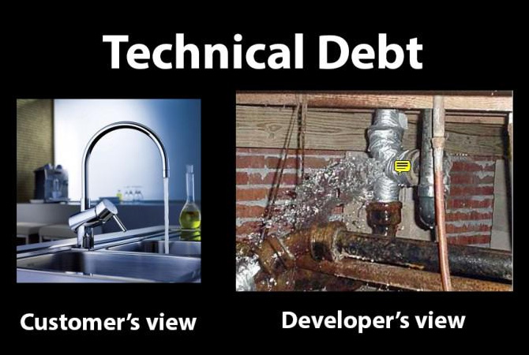

> Improve your craft, write the cleanest code you know how at that point in time,
> learn from your mistakes (and that of others) and always aim to improve.

I think looking at the plumbing behind many designs could make one stay up for
weeks. Now, when I refer to designs in this case I mean anything from a house
that was built down to your toaster. How many shortcuts were taken to get
the job done?

## Technical Debt

In software, we refer to the build up of bad shortcuts as "technical debt" -
hacks or bad implementations that build over time that should be fixed in
future iterations. In reality, how often do they get attended to?

Looking at the software stack we can see how some decisions and changes that
build over time can cause horrors behind the scenes, all the way from graphics to the
entire system architecture:

-   **Graphics**. Think Photoshop. How many revisions of that file exist? How many
    layers are there? How many layers are actually named?

-   **Websites**. Think about how many lines appear in each script or stylesheet?
    How well formatted is the HTML? Are there tables defining the layout?
    Let's not get started on the optimization of images.

-   **Applications & Services**. Where is the business logic? What does the mapping
    or Anti-Corruption Layer look like? What does the configuration file look
    like? Where are the passwords stored? What does the documentation look like?

-   **System architecture**. Do you know what servers and services are being used
    and by whom? Are they routed correctly? Can you easily detect if there is a
    problem with the load balancing? How do you know if one of the nodes are not
    responding correctly? Perhaps draw a system diagram of an enterprise system
    just to shock yourself.

-   **Organization**. _(Heck, let's throw in the business too)_ What does the
    company structure of an enterprise organization look like? Draw another
    diagram just to confuse yourself. How often does it change?

Behind anything that looks appealing is something dark and sinister looming and
waiting to jump out at you and scream "BOO!"

_Source of image: Unknown_

We are in the real world where things change rapidly. Deadlines loom,
people change, teams change, strategies change, organizations
and companies change. So, it seriously becomes tough to keep things looking
good under the hood of our applications.

Worst of all, the code you wrote that looks great today will suck in the
future and may possibly make someone want to pull their hair out. _This someone
could be future you._

On the bright side, at least you know you are learning and improving but
unfortunately you are actively contributing to today's problems.

## It's a harsh reality

Let's pause. Breathe. Before you throw verbal rocks at me, or even worse, throw
your craft out the window, hear me out.

1.  I apologize for painting this depressing picture. I didn't do it
    to instill doom and gloom, I promise.

2.  We can't use these issues as a scapegoat. Imagine the horrors we would face if
    we didn't actually try our best.

### Accept it

I highlighted the reality because a while ago I was crippled by the concept of
clean code. I became a digital neat freak and I was fighting a losing battle.
I became so particular with practices, principles and the opinions of others
that I didn't want to write code anymore.

Now that's a terrible place to be in. When you are cognizant of code smells,
then code smells stand out like `NullReferenceException`'s.

Accept that code will never be perfect.

### Free yourself

I believe that great software developers know that their code is not great.
They know that they aren't digital gods amongst mere mortals. They are aware
of trade-offs and the impact of their decisions. And one day they will look
back on their code and think "what the hell was I trying to do here?"
But they try and they improve.

Knowing this makes contributing to source code less daunting. Let this free
yourself from any debilitating feelings you may have when it comes to writing
code.

### Just try your best

The practices, principles and opinions others have are born from mistakes that
were made in the past. It's important to add this to your development toolbox
and know what to use and when. Just try your best.

### Be kind to others

When you see someone is writing code (or has written code) that could cause a potential meltdown,
either to you or to the production environment, kindly let the person know
why the implementation is not a good idea.

Being harsh without practical validation only creates a negative environment
where people choose not to collaborate.

You can't change the way people think but you can positively influence them.

## My final thoughts

We need to be less harsh on ourselves and on others. The best we can do is try
to improve our craft, write the cleanest code we know how at that point in time,
learn from our mistakes (and that of others) and always aim to improve.

### Summary

-   Accept that code will never be perfect.
-   Even the best software developers make mistakes.
-   Just try your best.
-   Learn from your mistakes and that of others.
-   You can't change the way people think but you can positively influence them.

### Learning materials

-   [**Pluralsight**](https://www.pluralsight.com/)

-   [**Code Complete**](https://www.amazon.com/Code-Complete-Practical-Handbook-Construction/dp/0735619670/):
    A Practical Handbook of Software Construction, Second Edition by
    [Steve McConnell](http://www.amazon.com/Steve-McConnell/e/B000APETRK/)

-   [**The Clean Coder**](https://www.amazon.com/Clean-Coder-Conduct-Professional-Programmers/dp/0137081073/):
    A Code of Conduct for Professional Programmers, First Edition by
    [Robert C. Martin](http://www.amazon.com/Robert-C.-Martin/e/B000APG87E/)

-   [**Clean Code**](https://www.amazon.com/Clean-Code-Handbook-Software-Craftsmanship/dp/0132350882/)
    A Handbook of Agile Software Craftsmanship, First Edition by
    [Robert C. Martin](http://www.amazon.com/Robert-C.-Martin/e/B000APG87E/)

-   [**Design Patterns**](https://www.amazon.com/Design-Patterns-Elements-Reusable-Object-Oriented/dp/0201633612):
    Elements of Reusable Object-Oriented Software, First Edition by
    [Erich Gamma](http://www.amazon.com/Erich-Gamma/e/B000AQ3QWI/)

* * *

### Mistakes and horrors

-   [C#'s Greatest Mistakes - Jon Skeet](https://vimeo.com/17151234)
-   [The Daily WTF](http://thedailywtf.com/)
-   [The most EVIL code you've ever seen](http://stackoverflow.com/questions/434414/what-is-the-most-evil-code-you-have-ever-seen-in-a-production-enterprise-environ)
-   [Hardcore JavaScript or Power of 30 lines](http://ipestov.com/hardcore-javascript-or-power-of-30-lines/)
