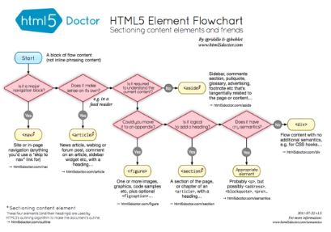

In 2005 [Google sampled](https://developers.google.com/webmasters/state-of-the-web/2005/)
over a billion documents. This highlighted popular class names,
elements, attributes and other related metadata.

The data surfaced many structural requirements related to `div`'s with
classes of `nav`, `header`, `footer`, `sidebar` etc.

As HTML5 is not intended to be used to markup documents for presentation, it
rather aims to add meaning to the elements within a document in order to
enhance:

-   accessibility,
-   search indexing,
-   internationalization and
-   interoperability.

Although the `div` is still useful to enhance the layout of a document, the
newly added structural elements in HTML5 will aid the semantic structuring
of your page.

**Note**: There are many books, articles, wikis and posts relating to these elements.
I wanted to document my research by combining the semantics, usage and code
samples to act as a cheatsheet to personally use.

## Header

You can use the `header` element to group introductory content or navigational
aids.

It's intended to contain headings but can also be used to wrap a section's
table of contents, site navigation, a search form or any relevant logos and so on.

```html
<header>
  <h1>Alliance vs Horde</h1>
  <p>
    Which side are you on? The Alliance or the Horde?
    Both sides have equally captivating
    stories to tell.
  </p>
</header>
```

[MDN Reference](https://developer.mozilla.org/en/docs/Web/HTML/Element/header)

## Footer

You can use the `footer` element in a document or many sections to
contain:

-   copyright information,
-   contact details,
-   author details,
-   navigational aid like a sitemap,
-   back to the top of the page links, or
-   related references.

```html
<footer>
  The content on the World of Warcraft Wiki is
  licensed under CC-BY-SA.
</footer>
```

**Note**: It doesn’t affect the document outline as it isn’t considered
as sectioning content.

[MDN Reference](https://developer.mozilla.org/en/docs/Web/HTML/Element/footer)

## Nav

You can use the `nav` element in your document or many sections to contain:

-   site wide navigation bar containing links to other pages or sections within
    a page,
-   sections that contain additional navigation aids, and
-   footer navigation containing common terms of service, privacy policy and
    copyright links.

```html
<header>
  <nav>
    <ul>
      <li>History</li>
      <li>Alliance</li>
      <li>Horde</li>
    </ul>
  </nav>
</header>
```

[MDN Reference](https://developer.mozilla.org/en/docs/Web/HTML/Element/nav)

## Article

You can use the `article` element for sections of content that can be
independently distributed or reused such as:

-   forum or blog post,
-   article for a magazine, newspaper or online website, or
-   content submitted by a user.

```html
<article>
  <header>
    <h1>For the Horde</h1>
    <p>
      <time
        pubdate
        datetime="2016-06-18T08:30:00.00">
      </time>
    </p>
  </header>
  <p>
    The Horde is made up of Orcs, Forsaken, Tauren,
    Trolls, Blood Elves, Goblins, and most recently,
    Pandaren (Huojin).
  </p>
</article>
```

[MDN Reference](https://developer.mozilla.org/en/docs/Web/HTML/Element/article)

## Section

You can use the `section` element for generic sections of content that need to
be explicitly listed in the document outline. You can then group content based
on a theme or context such as:

-   introductions,
-   news items,
-   contact information, and
-   numbered sections of a thesis.

```html
<article>
  <section>
    <h1>King of the Alliance</h1>
    <p>
      The Supreme Allied Commander of the humans, also
      known as the king. This title is typically given
      to a hereditary, male monarch of a nation, region
      or state.
    </p>
  </section>
  <section>
    <h1>Warchief of the Horde</h1>
    <p>
    Similar to the king of the humans, the Warchief
    is the military leader of the Orcish Horde.
    </p>
  </section>
</article>
```

[MDN Reference](https://developer.mozilla.org/en/docs/Web/HTML/Element/section)

## Aside

You can use the `aside` element for sections of content that is seperate from
but relates to its surrounding content such as:

-   quotes,
-   sidebars,
-   related articles,
-   advertising, or
-   navigational aid.

```html
<article>
  <h1>Lore</h1>
  <p>
    Blizzard's background story to the Warcraft
    series of games.
  </p>
</article>
<aside>
  <h1>Warcraft: The Beginning</h1>
  <p>
    A movie directed by Duncan Jones, produced
    by Legendary Pictures, and distributed by
    Universal Pictures.
  </p>
</aside>
```

[MDN Reference](https://developer.mozilla.org/en/docs/Web/HTML/Element/aside)

## Compatibility

Browsers that don't support the new elements will render them as a `span`. If
you want to enforce compatibility with legacy browsers you can style
these elements in CSS to be block-level elements.

```css
article, section, aside, nav, header, footer {
  display: block;
}
```

Unfortunately some legacy browsers don't apply styling to unknown elements.
If you need to support them, you could reference the
[HTML5 Shiv JavaScript](https://github.com/aFarkas/html5shiv)
for display and printing of your documents.

```html
<!--[if lt IE 9]>
  <script src="html5shiv.js"></script>
<![endif]-->
```

## My final thoughts

When I tested the document outline of my blog I realized that I have been
using these elements incorrectly as they provided little to no and often
incorrect meaning to the structure of my documents. It's amazing what a bit of
research can teach you.

You can test the structure of your documents using Document Outline tools.
Unfortunately I cannot vouch for the correctness of the tools provided below.

-   [Online tester](https://gsnedders.html5.org) by gsnedders
-   HTML5 Outliner [Chrome Extension](https://chrome.google.com/webstore/detail/html5-outliner/afoibpobokebhgfnknfndkgemglggomo?hl=en)
    by Dominykas Blyžė
-   HTML5 Outliner [Firefox Extension](https://addons.mozilla.org/en-US/firefox/addon/html5_outliner/)
    by arky

It can be tricky to know what to use and when.
[HTML5 Doctor](http://html5doctor.com) has a great
flowchart to help save time when making these decisions. They provide an
"easy-to-understand HTML5 sectioning element flowchart to
help you get to grips with some of the new elements in HTML5."


_Source of image: [HTML5 Doctor](http://html5doctor.com/downloads/h5d-sectioning-flowchart.pdf)_

* * *

## References

-   [W3.org Wiki](https://www.w3.org/wiki/HTML_structural_elements)
-   A Book Apart: [HTML5 for web designers](https://abookapart.com/products/html5-for-web-designers)
    by Jeremy Keith
-   [Let's Talk about Semantics](http://html5doctor.com/lets-talk-about-semantics/)
    by HTML5 Doctor
-   [HTML5 Semantics](https://www.smashingmagazine.com/2011/11/html5-semantics/)
    by Bruce Lawson at Smashing Magazine
-   [World of Warcraft](http://wowwiki.wikia.com/) references used in examples
