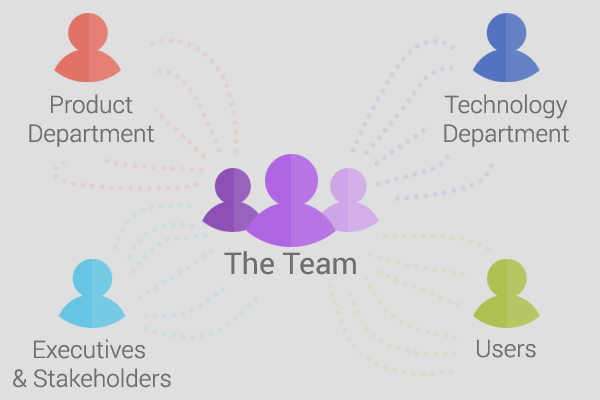
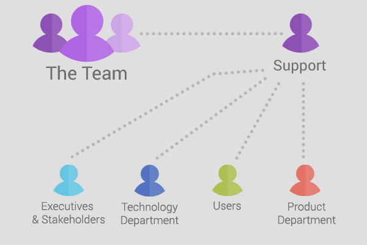
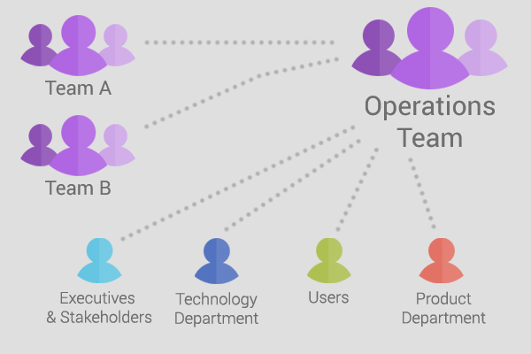

> Get the support you need to make the product and operating the product
> a success.

Teams cannot focus on sprint work when there are multiple communication channels
filtering into the team at any given point in time.

_Source of image: Clarice Bouwer_

This form of communication can occur for many reasons:

-   Massive panic due to downtime or issues in production.
-   To get information for troubleshooting or pinpointing a problem.
-   Little to no escalation procedures or escalation procedures are not followed.
-   Lack of understanding the overall system or product architecture.
-   Little to no documentation of the overall system or product architecture.
-   Go-to people within a team who can quickly assist in the event of failure.

Obviously both the team and the people outside the team, including the users,
want the system to be up and stable.

Depending on your product or the nature of your team and workload, operational
tasks may come and go. When they are prevalent, your team needs to find ways to
streamline the communication coming into the team so that you can support the
product in a sustainable way.

## Support role

Your team could introduce a rotating support role where one technical person
handles all incoming requests for that sprint and filters it into the team
if necessary.

_Source of image: Clarice Bouwer_

Based on the nature of the queries entering the team, an escalation process
can be created and shared with the organization in order to lessen the burden
on the person who is on support.

Sometimes you may end up in a situation where there are only one or two
technically strong people in a team which makes a support role quite stressful.

Open communication channels between the product and technology team to highlight
the issues you are facing as a team so that they can find ways to mitigate
the unsustainable operational tasks you constantly need to tackle.

**Tip**: If your team has a mailing list, ensure all communication is sent to
the team mailing list instead of directly to one person. The people within the
team can setup email rules to move all emails sent directly to the team so that
it does not clutter their inbox. If anyone picks up an issue, they can resolve
it if they have the capacity to do so as long as they communicate it with the
rest of the team.

## Operations team

You may be fortunate enough to have an operations team within your organization
that handles the bulk of the support role for you.

Here an escalation process is highly recommended so that the operations team
knows when and which teams to filter queries to.

_Source of image: Clarice Bouwer_

It is important to liaise with the operations team and guide them with incorrect
escalations so that they can handle them more efficiently in the future.

If something changes in your system, they need to be aware of these changes if
there is an impact to the users or ways the systems are monitored.

A ticketing system can be introduced or utilized to raise issues and get
feedback regarding the resolution of issues. Visibility to this system is
essential as tickets can get lost in heaps of corporate emails.

## Monitoring & feedback loops

No team can function optimally without appropriate monitoring in place.

It is essential to have your systems monitored with quick feedback loops so that
you know when something is down or failing. Some examples include:

-   System health checks
-   Product and service availability and uptime
-   Dependency integration points are working
-   Changes you have made have not affected other features or products
    (automated regression test suite)

When something does go down, dependent product teams need to be notified. This
applies for when things are up and running again.

## Reactive systems design

You could look into building your systems to be more
[reactive](http://www.reactivemanifesto.org/) meaning that they respond in a
timely manner, stay responsive when dependencies fail, respond under varying
loads, and are loosely coupled from its dependencies.

When systems fail, your monitoring tools could notify the right people to get
the systems back up and running without hindering the user experience to a
large extent.

## My final thoughts

Fighting fires is a tedious and stressful part of software development
especially in larger organizations with what seem to be millions of integration
points. Not many people know or understand the bigger picture.

People can end up scrambling around trying to figure out what and why something
broke. When too much communication enters your team, you need to find ways to
streamline the communication process and find sustainable ways to proceed.

The world is not on your shoulders. Speak to your team, line manager,
scrum master (or Agile coach), and product owner to get the support you need
to make the product and operating the product a success.
