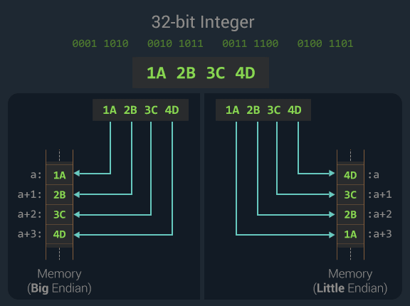

> The byte order mark or BOM is an invisible Unicode magic number that can be
> found at the beginning of a text stream.

We recently changed static HTML on a web page and all Unicode characters
displayed incorrectly. This was [caused](/rca/unicode-displaying-incorrectly/)
by the missing byte order mark in the UTF-8 file which Windows actually requires.

This post was inspired by my curiosity and investigation of the byte order mark
but further grew as it touched on UTF, endianness and the usage of the byte order
mark in UTF-8.

## Unicode

If you are new to Unicode then I suggest you read up on it before continuing.
You can start by reading
[Joel Spolsky's](http://www.joelonsoftware.com/articles/Unicode.html) article
from 2003.

In this post I make references to Unicode code points. They are simply the
numerical positions of Unicode characters in the code space of 1,114,112
characters.

> For Unicode, the particular sequence of bits is called a code unit – for
> the UCS-4 encoding, any code point is encoded as 4-byte (octet) binary
> numbers, while in the UTF-8 encoding, different code points are encoded as
> sequences from one to four bytes long, forming a self-synchronizing code. ~
> [Wikipedia](https://en.wikipedia.org/wiki/Code_point)

## UTF

UTF stands for Unicode Transformation Format. This encoding maps
Unicode code points (from `U+0000` to `U+10FFFF`) to one or more code units or
[word](https://en.wikipedia.org/wiki/Word_(computer_architecture)) depending on
the encoding form (eg. UTF-8, UTF-16 and UTF-32) used.

Conversions between encoding forms are algorithmic making it fast and lossless.

The table below shows the different encoding forms with some of their properties.

| Name                            |   UTF-8  |  UTF-16  |  UTF-32 |
| ------------------------------- | :------: | :------: | :-----: |
| Code unit or word size          |   8-bit  |  16-bit  |  32-bit |
| Fewest bytes used per character |  1 byte  |  2 bytes | 4 bytes |
| Most bytes used per character   |  4 bytes |  4 bytes | 4 bytes |
| Byte width for a code unit      | Variable | Variable |  Fixed  |

Essentially a single character represented as a sequence of
`<fewest bytes>` to `<most bytes>` `<code unit size>`-bit code units or word,
depending on the encoding form:

-   UTF-8 is variable as it can have a sequence of one to four 8-bit bytes per character
-   UTF-16 is variable as it can have a sequence of one or two 16-bit code units per character
-   UTF-32 is fixed as it has a single 32-bit code unit per character

As UTF-32 is fixed length, it can get rather bloated and use up unnecessary
memory and storage space for strings of characters. Therefore it's main usage
is in internal APIs where the data is single code points or glyphs.

Let's look at an example using the Pilcrow sign (¶). It's Unicode code point
is `U+00B6`.

-   In UTF-8 it converts to `C2 B6` which is a two 8-bit sequence of
    `[1100 0010] [1011 0110]`.

-   In UTF-16 it converts to `00 B6` which is a one 16-bit sequence of
    `[0000 0000 1011 0110]`.

-   In UTF-32 it converts to `00 00 00 B6` which is a one 32-bit sequence of
    `[1011 0110 0000 0000 0000 0000 0000 0000]`

## Endianness

This is just a fancy way of saying how the **bytes must be ordered** during the
read and the write of the stream. This order is categorized by big-endian and
little-endian.

Bytes can be processed from left to right (big-endian: most significant byte
first) or from right to left (little-endian: least significant byte first).

_Source of image: Clarice Bouwer_

As the word size for UTF-8 streams is 8-bits, one byte is read or written at a
time. This means the encoding form is byte-oriented so there is no byte order
problem for UTF-8.

With UTF-16 and UTF-32 they have word sizes of 2 (16-bits) and 4 (32-bits) bytes
respectively making the byte order matter when it comes to certain hardware,
protocols or programs. The byte order is indicated with the byte order mark
or in short, the BOM.

This table shows UTF-16 and UTF-32 with their big-endian (BE)
and little-endian (LE) equivalents. If a stream is not saved with the BOM then
it will default to big-endian.

| Encoding | Little-Endian | Big-Endian |
| -------- | :-----------: | :--------: |
| UTF-16   |       -       |   Default  |
| UTF-16LE |   \\&lt;BOM>  |      -     |
| UTF-16BE |       -       | \\&lt;BOM> |
| UTF-32   |       -       |   Default  |
| UTF-32LE |   \\&lt;BOM>  |      -     |
| UTF-32BE |       -       | \\&lt;BOM> |

## Byte order mark (BOM)

It is an invisible Unicode magic number found at the beginning of a data stream
indicating the encoding and endianness.

This table shows encoding forms with their BOM byte sequence and byte order.

| Encoding | Endianness    | BOM bytes   |
| -------- | ------------- | ----------- |
| UTF-8    | N/A           | EF BB BF    |
| UTF-16   | Big-endian    | FE FF       |
| UTF-16   | Little-endian | FF FE       |
| UTF-32   | Big-endian    | 00 00 FE FF |
| UTF-32   | Little-endian | FF FE 00 00 |

Let's say we have a text stream of the following characters: `¶@«®`. The Unicode
code points for each are `U+00B6`, `U+0040`, `U+00AB` and `U+00AE`.

 and UTF-8")

_Source of image: Clarice Bouwer_

When the UTF-16 streams are opened, the BOM defines the order the bytes must be
read in and are read two bytes (16-bits) at a time. The way the bytes are mapped
back to the Unicode code points are based on the endianness.

When the UTF-8 stream is opened, the BOM has no impact on the byte order as
the bytes are read one at a time.

Looking at the Heavy Black Heart (❤) character at code point `U+2764`:

-   In UTF-8 it converts to `E2 9D A4` which is a three 8-bit sequence of
    `[1110 0010] [1001 1101] [1010 0100]`.

-   In UTF-16BE it converts to `27 64` which is a one 16-bit sequence of
    `[0010 0111 0110 0100]`.

-   In UTF-16LE it converts to `64 27` which is a one 16-bit sequence of
    `[0110 0100 0010 0111]`.

-   In UTF-32BE it converts to `00 00 27 64` which is a one 32-bit sequence of
    `[0000 0000 0000 0000 0010 0111 0110 0100]`.

-   In UTF-32LE it converts to `64 27 00 00` which is a one 32-bit sequence of
    `[0110 0100 0010 0111 0000 0000 0000 0000]`.

## UTF-8

When the BOM exists it acts as an **encoding signature** only. In this case it
is referred to as the UTF-8 signature.

Although it is optional and doesn't signify the byte order, some applications
require its presence. I learned the [hard way](/rca/unicode-displaying-incorrectly)
with Microsoft Windows and some of its applications.

> Microsoft compilers and interpreters, and many pieces of software on
> Microsoft Windows such as Notepad treat the BOM as a required magic
> number rather than use heuristics. These tools add a BOM when saving text
> as UTF-8, and cannot interpret UTF-8 unless the BOM is present, or the file
> contains only ASCII bytes. ~ [Wikipedia](https://en.wikipedia.org/wiki/Byte_order_mark)

There are also instances where the BOM must not exist. This can include files
that need to start with specific characters like the human readable shebang
magic number (`#!`) in Unix shell scripts.

It's also nice to know that ASCII is a subset of Unicode. It is a 7-bit encoding
but 1 bit goes unused and is always saved as 1 byte. This makes UTF-8 backwards
compatible with ASCII assuming the file doesn't use characters outside of the
ASCII range.

If the BOM exists but cannot be interpreted correctly the file will start with
``. An example is viewing the BOM file with the Latin 1 (ISO 8859-1)
character encoding.

## BOM guidelines

If you are working directly with a stream or are uncertain of which encoding to
use, [Unicode.org](http://unicode.org/faq/utf_bom.html) has the following
guidelines for dealing with the BOM:

-   A particular protocol (e.g. Microsoft conventions for .txt files) may require
    use of the BOM on certain Unicode data streams, such as files. When you
    need to conform to such a protocol, use a BOM.

-   Some protocols allow optional BOMs in the case of untagged text. In those cases,

    -   Where a text data stream is known to be plain text, but of unknown encoding,
        BOM can be used as a signature. If there is no BOM, the encoding could be
        anything.
    -   Where a text data stream is known to be plain Unicode text
        (but not which endian), then BOM can be used as a signature. If there is no
        BOM, the text should be interpreted as big-endian.

-   Some byte oriented protocols expect ASCII characters at the beginning of a
    file. If UTF-8 is used with these protocols, use of the BOM as encoding form
    signature should be avoided.

-   Where the precise type of the data stream is known (e.g. Unicode big-endian
    or Unicode little-endian), the BOM should not be used. In particular,
    whenever a data stream is declared to be UTF-16BE, UTF-16LE, UTF-32BE or
    UTF-32LE a BOM must not be used.

<small>This excerpt can be found under the question "**How I should deal with
BOMs?**"</small>

## My final thoughts

The BOM is usually handled in the background by the systems you are working
on. As it is invisible it generally goes unnoticed.

If you start to experience some funny visuals, you are most likely experiencing
an encoding problem that can easily be fixed. Using a Hex Editor you can
identify the invisible bytes in a file.

* * *

## References

-   [Root cause analysis](/rca/unicode-displaying-incorrectly/) inspiring this post
-   [What is Unicode?](http://unicode.org/standard/WhatIsUnicode.html) - Unicode.org
-   [Introduction to Unicode](http://www.joelonsoftware.com/articles/Unicode.html) - Joel on Software
-   [Unicode code point](https://en.wikipedia.org/wiki/Code_point) - Wikipedia.org
-   [Unicode character table](http://unicode-table.com/) - Unicode-table.com
-   [Endianness](https://en.wikipedia.org/wiki/Endianness) - Wikipedia.org
-   [Byte order mark](https://en.wikipedia.org/wiki/Byte_order_mark) - Wikipedia.org
-   [FAQs](http://unicode.org/faq/utf_bom.html) (UTF-8, UTF-16, UTF-32 & BOM) - Unicode.org
-   [The byte order mark in HTML](https://www.w3.org/International/questions/qa-byte-order-mark) - W3.org
-   [Using byte order marks](https://msdn.microsoft.com/en-us/library/windows/desktop/dd374101(v=vs.85).aspx) - MSDN
-   [UTF-8](http://www.utf-8.com/) - Utf-8.com
-   [The Turkey Test](http://www.moserware.com/2008/02/does-your-code-pass-turkey-test.html) - moserware.com

[Copyright](https://www.w3.org/Consortium/Legal/ipr-notice#Copyright)
© 2016 W3C® ([MIT](http://www.csail.mit.edu/), [ERCIM](http://www.ercim.eu/),
[Keio](http://www.keio.ac.jp/), [Beihang](http://ev.buaa.edu.cn/)).
This document includes material copied from or derived from
[The byte-order mark (BOM) in HTML](https://www.w3.org/International/questions/qa-byte-order-mark)."
The [BOM](/img/posts/byte-order-mark/bom.gif)
image in this post adapted from their endianness image.
