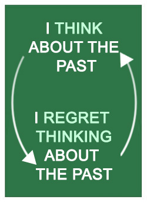
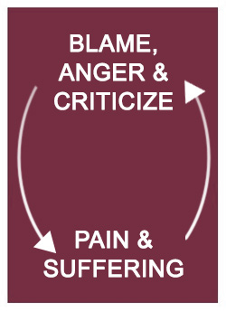
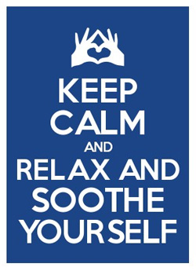
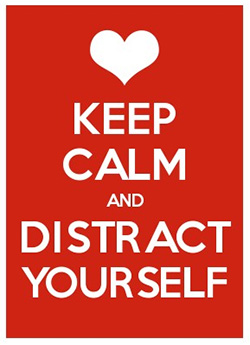

> Oliver Goldsmith says that the mind is ever ingenious in making its own distress.

In [Part 2](/blog/rewire-your-brain-2/) we looked at how we can activate
five neuro pathways in order to create new neural networks in the brain. This
technique helps us rewire the brain to change our behavior.

In Part 3 we will focus on Distress Tolerance. This skill also helps to improve
our behavior by introducing skills that help us cope under distress.

It is useful in a crisis or bad situation where emotions are overwhelming.
The skills help us cope and survive the situation so that we can tolerate both
the physical and emotional pain that we experience.

Distress Tolerance is a module in [Dialectical Behavior Therapy](http://behavioraltech.org/resources/whatisdbt.cfm)
(DBT).

According to [behavioraltech.org](http://behavioraltech.org), DBT is a cognitive behavioral treatment that
was originally developed to treat chronically suicidal individuals diagnosed with
borderline personality disorder (BPD) and it is now recognized as the
gold standard psychological treatment for this population.

They go on to say that research says it is effective in treating other disorders such as
substance dependence, depression, post-traumatic stress disorder (PTSD),
and eating disorders.

> I believe that Distress Tolerance offers essential life skills. It empowers
> you to cope with simple or complex day-to-day challenges. It is a great tool
> to use on your self improvement journey.

These skills don't teach us to change the situation. We just accept that it
is the way it is because of a lot of shit that happened leading to that moment.
We learn to tolerate the overwhelming emotions and minimize the suffering.

Through deliberate practice, I believe that the more this skill is exercised, the
more automatic it becomes, **thus our brains are rewired to minimize suffering**.

* * *

We don't know when we are going to hurt and sometimes it's outside our control.
Let's see how we can cope with the bullshit that comes our way.

Firstly, from my perspective,
if you ever played Diablo 3, you will be familiar with the Inferno level—
the hardest difficulty level in the game.
Well, I experience my pain on Inferno level.

My physical and emotional pain is so **overwhelmingly painful** that
I obviously can't think straight in that mindset. This leads to the inability to
create solutions to the challenges I am facing. It also leads to awkward
reactions and regrettable behavior.

## Self-destructive coping mechanisms

Self-destructive coping mechanisms is not how we should deal with the bullshit
that comes our way, but in many times it's the only way we know how to cope.

Let's make up a scenario. Alex gets into a fight at work about something miniscule.
This fight leaves him drained and desperately wanting to binge on some
crisp beers in his fridge at home.

He drives home thinking about how he could have changed Ryan's perspective or how
he could have handled the situation better. Alex is still angry and traffic is a
bitch. He curses, swears and flips off other drivers while he critically dwells
on the situation.

He starts to fear that it may impact his position at work and gets
anxious for the next day. Finally he gets home and hits the wall as hard as
he can with his fist. The wall doesn't crack under his force and he starts
drinking beer after beer alone at home not wanting to see other people.

Now he has a semi-broken fist and a monstrous hangover to start a new day.

* * *

Strategies such as dwelling on the past, being anxious about the future,
isolation from others, taking frustrations out on others, substance abuse,
self-harm, and so on, are all self-destructive coping mechanisms.

These mechanisms only deepens the pain both physically and emotionally
and come at a negative cost.

Think about it. If you are obsessively dwelling on the past, you are missing out
on what is happening right now. You miss out on all the good things happening
at this moment. You stay stuck and depressed on past things that you cannot change
and later regret that you got stuck and depressed and missed out on now.

It's a negative reinforcing loop.

What are your self-destructive coping mechanisms? Think about the cost it has
on your relationships, career, health, wealth and your mindset. Become aware of the
dangers that unfold when leveraging these self-destructive coping mechanisms.

We need to replace these bad coping mechanisms with something more healthy.

## Radical acceptance

We can cope with the bullshit that comes our way by changing our attitude.
Instead of reacting by getting angry, upset, blaming someone or something, or
criticizing yourself for causing pain; you can radically accept the situation.

That means that:

-   You should **acknowledge the situation** you currently find yourself in.
-   **Don't judge** the event **or criticize** yourself.
-   **Recognize** that **the situation exists because of** a lot of shit that happened
    in **the past** leading up to this moment.

You **cannot change what is outside of your control**. You can control your
actions, behavior and attitude.

Blaming others or the situation and getting angry doesn't alleviate your pain
and suffering. It just makes it worse because you can't change it. Another
negative reinforcing loop exists here. **_Poor solutions come from being
blinded by rage_**.

It doesn't mean that you agree with or condone the bad behavior
of others or the circumstances, it just stops you from trying to change
what you cannot. You minimize the suffering by refocusing your attention
on what you can do now.

This can help you think more clearly and figure out a better way to cope.

Tell yourself phrases like:

-   This is the way it has to be
-   It's no use fighting the past
-   The present is the only moment I have control over
-   This moment is exactly as it should be, given what’s happened before

## Distraction plan

You can temporarily distract yourself from the overwhelming pain. Focus
on something that can help you calm down. It's like those silly calm down posters,
like the one on the left.

Distraction skills can help you formulate a plan to deflect the pain and
discomfort you feel at that time. Choose activities that work for you so that
you can use them when you find yourself in dire straits.

The idea is not to avoid the challenges you
are facing, rather to get your mind to a place of clarity and focus. This will
help you find better solutions to the challenges and behave or react in a
healthier way.

-   **Distract yourself from self-destructive behaviors**

    Instead of hurting yourself try techniques like squeezing an ice-cube, screaming
    into a pillow or while you're alone in your car, snap a rubber band on your wrist, write
    hate letters to people and throw them away, throw socks or paper balls as hard
    as you can on a wall or cry.

    Try any technique that you can think of, or Google,
    that will alleviate the pain without you physically harming yourself.

-   **Distract yourself with pleasurable activities**

    Do something that makes you feel good such as exercise, a walk in the park,
    stretch your muscles, play video games, go to the movies, make your favorite
    food, watch something silly on YouTube, get a massage, sit in the garden,
    read a good book, do something nice that you have been putting off, take a
    bubble bath.

    Whatever your flavor of pleasurable things to do, try doing one
    to take your mind off things allowing yourself time to cool down.

-   **Distract yourself by paying attention to someone else**

    Do something for someone else like seeing if a friend or family member needs help
    with something or volunteer somewhere.

    Take the attention off yourself. You can be _creepy_ and go to a public place
    like a mall and watch what other people are doing, what they're wearing, how they
    are walking and what they are saying.

    Think about someone you care about. If you had to talk to them now, what would
    they say to you?

-   **Distract your thoughts**

    We can't control what thoughts our brains conjure up for us. The more attention
    we give it, the more it stays. The harder we try to forget about it, the same
    applies.

    When we get stuck in a negative thought pattern it keeps us [stuck](https://singjupost.com/the-secret-of-becoming-mentally-strong-by-amy-morin-full-transcript/).
    We want to get out of the unhealthy beliefs of ourselves, others and the world.

    To distract our thoughts we can try think of other memories or creative images.
    Try picture pleasant events from the past or imagine a calming fantasy place.

    Do this in detail. What detailed imagery do you see? What does it look like?
    What colors do you see? Who is with you? What do they look like? What smells are there?
    What sensations are you experiencing?

-   **Distract yourself by leaving**

    Sometimes we forget that we can exit a situation.

    If it is a heated conversation with a colleague or loved one and you aren't coping,
    tell the person that you need to step out. Give them an idea when you will
    be back so that you manage their expectations.

    If you are in a meeting and your emotions are flaring up, your contribution
    won't be healthy. Politely excuse yourself from the meeting and return when
    you have calmed down.

    If you are working on code that isn't compiling or working the way you intended
    and find yourself getting frustrated, get up and clear your mind. It's also
    wise to get two or more developers to work with you so that you can conquer
    the problem as a collective.

    If you are in a place waiting for service which is taking too long, instead
    of getting angry, simply leave. You can always come back later if you so choose.

-   **Distract yourself with tasks and chores**

    Take the time to complete chores or things on your TODO list like doing the
    dishes, cleaning your room, redecorating, cleaning out your closet, organizing
    or calling someone you haven't called in a while.

-   **Distract yourself by counting**

    This is a simple skill that can keep your mind busy. You can count your
    breaths by breathing deeply; count cars, people, sounds, sensations, clouds;
    or count or subtract in increments of a number greater than 1.

## Relaxation plan

When you are relaxed, your body feels good. Your heart beats slowly and your
blood pressure is reduced.

You are no longer in survival mode or in a state of emergency panicking about facing
or fleeing the situation.

When you are relaxed, your brain is in a healthier state to cope with the
challenges that you face.

The activities below are indented to relax and soothe you. Find what
works for you with your senses: smell, sight, hearing, taste and touch; it needs
to introduce peace and serenity in that moment.

The activities you choose will formulate your relaxation plan that you can
refer to when you find yourself in a pickle. It's wise to formulate two: one
for at home and one outside of home.

-   **Smell**

    Find smells that trigger good memories or make you feel good.

    You can burn scented candles or incense; use scented oils; perfumes/colognes; go somewhere
    with pleasing scents; bake; lie down in the park; buy flowers; or hug someone
    who smells good.

-   **Sight**

    Apparently a large portion of our brain is devoted solely to our sense of
    sight so what you look at can have powerful effects on you.

    That means that you can soothe yourself by finding images that have that effect on you. You
    can find them in magazines, go to places, draw or paint your own or use a
    photograph.

    You can also use cards with meaningful quotes or text on them. Some key rings
    come in the form of small booklets with inspirational messages in them.

-   **Hearing**

    Listen to music that soothes you, **not music that reinforces how you are
    currently feeling**. It creates a negative reinforcing loop which sucks you
    in deeper.

    You can listen to white noise; classical, relaxation or meditative music;
    [music for developers](https://musicforprogramming.net/);
    [coffee shop noises](https://coffitivity.com/); go to a place with peaceful sounds
    like the Botanical Gardens or a day spa; [nature sounds or ambiance](https://www.calmsound.com/).

-   **Taste**

    Get in touch with tastes that ignite pleasant memories or make you feel good.
    Try not to over-indulge as it may result in regret, guilt and shame.

    Eat your favorite meal or snack; carry your favorite sweets with you; eat
    ice cream, chocolate, pudding, fruit; or have a soothing hot beverage.

    Taste each bite (or sip) as you chew (or sip) slowly to enjoy it to its fullest.

-   **Touch**

    We touch a lot of things each day. As our largest organ is our skin we can
    use this to our advantage when we need to soothe ourselves.

    Carry something you enjoy the touch of like something soft, fluffy or velvety;
    enjoy a hot or cold shower where the water trickles on your skin;
    have a warm bubble bath with scented oils, candles and dimmed lights where you
    enjoy the bubbles popping gently on your skin; get a massage and enjoy the
    sensation that activate and relax your muscles; or simply wear clothes that
    you feel comfortable in.

## My final thoughts

Through Radical Acceptance, Distraction Plans and Relaxation Plans we are
one step closer to properly coping. DBT offers other modules that cover
coping mechanisms such as emotion regulation skills, mindfulness skills, and
interpersonal effectiveness skills.

Identify negative coping mechanisms and avoid self-destructive behaviors so
that you break the negative reinforcing loop.

Accept that you can't change the past - radically accept the situation for what it is and come to
terms with the fact that you can't change what has happened leading up to the
situation. You can only control how you react in the circumstances.

**Distract. Relax. Cope.**

-   Distract yourself temporarily from the overwhelming emotional pain.
-   Relax and soothe yourself so that you are in a better frame of mind.
-   Cope with the emotion to influence healthy behavior or reaction.

The more these steps are followed the more I believe our brains will be rewired
to better deal with painful situations thus lowering the amount of suffering
that we typically endure.

* * *

**Credit**: This post is a summary of the Distress Tolerance chapter in The Dialectical
Behavior Skills Workbook listed in the references below.

You can buy it on [Amazon](https://www.amazon.com/Dialectical-Behavior-Therapy-Skills-Workbook/dp/1572245131)
and [Google Books](https://books.google.co.za/books/about/The_Dialectical_Behavior_Therapy_Skills.html?id=pan4976pG6sC&redir_esc=y).

* * *

## References

-   [DBT](http://behavioraltech.org/resources/whatisdbt.cfm),
    What is DBT?, The Linehan Institute, Behavioral Tech Research

-   [Behavioral Tech](http://behavioraltech.org),
    The Linehan Institute, Behavioral Tech Research

-   [The Dialectical Behavior Therapy Skills Workbook](https://myjourneythroughmadness.files.wordpress.com/2017/01/dbt.pdf),
    Practical DBT exercises for learning Mindfulness, Interpersonal Effectiveness,
    Emotion Regulation and Distress Tolerance by Matthew McKay, PH.D, Jeffrey C. Wood,
    Psy.D, Jeffrey Brantley, MD

-   [The Secret of Becoming Mentally Strong](https://singjupost.com/the-secret-of-becoming-mentally-strong-by-amy-morin-full-transcript/),
    Amy Morin, TEDxOcala

-   [Music for developers](https://musicforprogramming.net/),
    musicForProgramming.net - A series of mixes intended for listening while
    '+task+' to aid concentration and increase productivity
    (also compatible with other activities).

-   [Coffee shop noises](https://coffitivity.com/), Coffitivity recreates the
    ambient sounds of a cafe to boost your creativity and help you work better.

-   [Nature sounds or ambiance](https://www.calmsound.com/),
    Calmsound - Free nature sounds, the oasis of relaxation.

[negative-reinforcing-loop-past]: /images/rewire-your-brain-3/negative-reinforcing-loop-past.jpg "I think about the past ↔ I regret thinking about the past"

[negative-reinforcing-loop-victim]: /images/rewire-your-brain-3/negative-reinforcing-loop-victim.jpg "Blame, anger and criticize ↔ Pain and suffering"

[keep-calm-distract]: /images/rewire-your-brain-3/keep-calm-distract.jpg "Keep calm and distract yourself"

[keep-calm-relax]: /images/rewire-your-brain-3/keep-calm-relax.jpg "Keep calm and Relax and Soothe Yourself"
