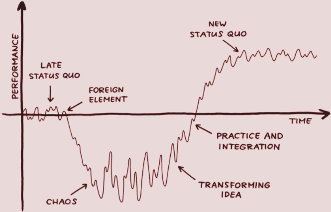
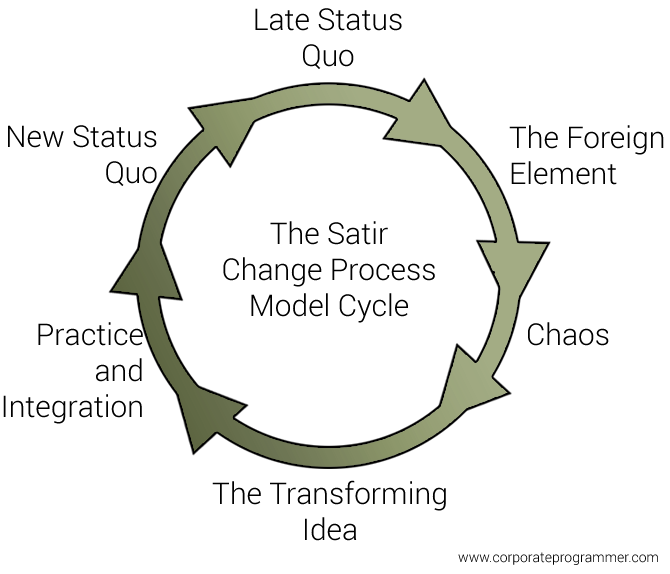

> Virginia Satir says that we can learn something new anytime we believe we can.
> Therefore we can learn to cope with what we are dealing with by readjusting the way
> we think.

In the [part 4](/blog/rewire-your-brain-4/), Survival Rules, we look at how we can identify childhood
survival rules, analyze them and decide if they are beneficial today.
Changing them is an interesting way of rewiring your brain as we change
old behaviors as these rules no longer apply to the current day.

* * *

This model was developed by the "Mother of Family Therapy": Virginia Satir
[1](#footnote-1-ref). It can improve your life
by **transforming the way you see and express yourself**
[2](#footnote-2-ref).

This model shows how you will predictably move through different stages
as you cope with unexpected and significant or major changes
[3](#footnote-3-ref).

It also describes the effects each stage has on your feelings, thinking,
performance and physiology. The principles in this model can help you
improve how you process change [2](#footnote-2-ref).

_Source of image: [Flicker](https://www.flickr.com/photos/jurgenappelo/5201852636). This illustration is adapted from the book [Management 3.0](http://www.management30.com)._

> Life is not what it's supposed to be. It's what it is.
> The way you cope with it is what makes the difference. ~ Virginia Satir

## The Late Status Quo

This stage describes your ordinary day-to-day. Although your feelings can
fluctuate you are still in familiar territory like pieces of a puzzle fitting
together. You are used to how things work and flow in this stage.

Emotions may be fluctuating from comfort, contentment, happiness, excitement,
to discomfort, dissatisfaction, unhappiness and depression or anxiousness.

## The Foreign Element

All of a sudden something needs to change. Your expectations are challenged.
Your familiarity is now shaken up due to unexpected information, a
significant event, invalidated assumptions or maybe the realization that
something you have been doing your whole life needs to change.

## Chaos

Now you are outside your comfort zone in a big unknown mysterious place. You
are in an unpredictable unfamiliar territory. This can be very scary by
also offer some creativity.

So it may feel unsafe. You may feel strong emotions which may confuse you:

-   Stress
-   Confusion
-   Discomfort
-   Pain
-   Fear
-   Excitement
-   Euphoria
-   Strong sense of urgency

You could behave in ways that are unfamiliar to you:

-   Trying to stay in control
-   Disengaging and retreating to some familiar activity
-   Focusing on one small part of the problem
-   Ignoring the chaos happening around you
-   Scrambling to find information about what is going on

This stage is vital to the transformation process so acknowledge your feelings
and build and use support systems. It can be very creative and a lot of ideas
can be generated here.

## The Transforming Idea

A powerful idea generated in the Chaos stage could lead to the transformation
process which sheds light on the change and helps you understand it more
and cope with it. This is the AHA! moment.

You may not know it is a transforming idea so just try it and see what happens.
If it's not, try something other AHA!

## Practice and Integration

The more you practice this new behavior extracted from your transforming idea
the more you integrate it into your life. It is a learning phase that allows for
mistakes so your progress may ebb and flow.

You have the opportunity to decide what is working and what isn't which makes
you more skilled and hopeful as you continuously learn.

## The New Status Quo

Once you have fully absorbed the change you become more healthier, calmer and
alert. You need to continue feeling safe in this space by practicing.

Emery sums it up elegantly by saying that:

-   You feel good about how rapidly you are learning.
-   You turn your attention toward other important areas of your life, armed with
    new skills, knowledge and confidence.
-   Eventually these new skills become second nature.
-   Your learnings become assumptions and expectations.
-   With time, the newness fades, and the New Status Quo becomes a Late Status Quo.
-   And the change cycle begins again.

_Source of image: Corporate Programmer_

## My final thoughts

This model can be used for any self-improvement need. Instead of tracking performance,
you could be tracking quality of life over time. Our survival rules are deeply
ingrained into us and we can pinpoint them, analyze them and decide if we still
need it or not. If we don't need it, we can change it and this is just one model
of how we can do so through reflection.

We don't want behaviors that cause:

-   Exhaustion
-   Misery
-   Lack of focus and concentration
-   Lack of self-care
-   Lack of social interaction
-   Lack of physical activity
-   Problems with relationships
-   Impending burn-out

There is a lot of material out there describing the model in detail. I just
wanted to document the idea as a model to help rewire the brain to transform  unhealthy behaviors to more positive behaviors. These stages show how a change
can impact us and how we can get to a point where we can thrive.

* * *

## References

1.  [Virginia Satir](https://en.wikipedia.org/wiki/Virginia_Satir), Wikipedia ([Navigate back](#footnote-1))

2.  [The Satir Change Model](http://stevenmsmith.com/ar-satir-change-model/),
    Steven M. Smith, Accelerating Team Productivity ([Navigate back](#footnote-2))

3.  [Managing Yourself Through Change](http://dhemery.com/articles/managing_yourself_through_change/),
    Dale H. Emery, Consultant to Software Teams and Leaders ([Navigate back](#footnote-3))

### Resources

-   [Framework 59 Virginia Satir Change Process](http://www.billsynnotandassociates.com.au/kb/257-framework-59-virginia-satir-change-process.html),
    Organisational Change Management Volume 1, Bill Synnot and Associates

-   [Virginia Satir Change Curve](https://www.flickr.com/photos/jurgenappelo/5201852636),
    Flicker, Jurgen Appelo says this illustration is part of the book [Management 3.0](http://www.management30.com)

-   [Chaos during change – don’t try to avoid it, manage it](http://10minutehr.com/2013/11/11/chaos-in-the-organisational-change-process-dont-try-to-avoid-it-manage-it/)

-   [You Can't Fight Change](https://www.stickyminds.com/article/you-cant-fight-change)

-   [Stress Is Needed For Success In NYC](http://www.hypnosisrapport.com/stress-is-needed-for-success-in-nyc/)

-   [Think Visually When Building an Agile Enterprise Change Plan](http://agileconsulting.blogspot.co.za/)

Icons made by <a href="http://www.freepik.com" title="Freepik">Freepik</a> from <a href="http://www.flaticon.com" title="Flaticon">www.flaticon.com</a> is licensed by <a href="http://creativecommons.org/licenses/by/3.0/" title="Creative Commons BY 3.0" target="\_blank">CC 3.0 BY</a>

[satir-change-graph]: /images/rewire-your-brain-5/satir-change-graph.png "Virginia Satir Change Curve"

[late-status-quo]: /images/rewire-your-brain-5/late-status-quo.png "The Late Status Quo"

[foreign-element]: /images/rewire-your-brain-5/foreign-element.png "The Foreign Element"

[chaos]: /images/rewire-your-brain-5/chaos.png "The Stage of Chaos"

[transforming-idea]: /images/rewire-your-brain-5/transforming-idea.png "The Transforming Idea"

[practice]: /images/rewire-your-brain-5/practice.png "Practice & Integration"

[new-status-quo]: /images/rewire-your-brain-5/new-status-quo.png "The New Status Quo"

[satir-change-model-cycle]: /images/rewire-your-brain-5/satir-change-model-cycle.png "Virginia Satir Change Curve"
