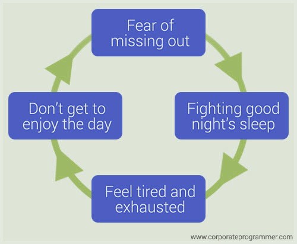
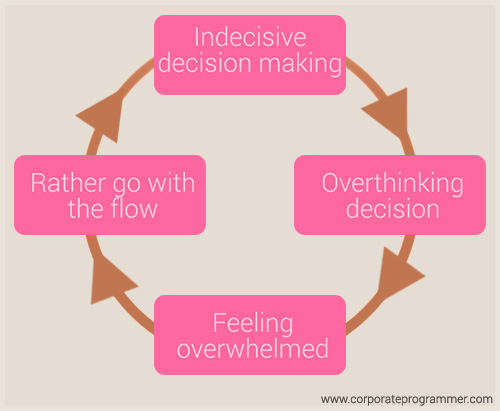
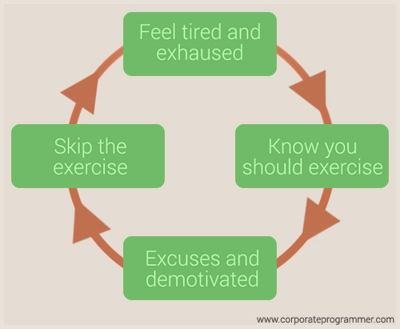

> Germany Kent says that it's a funny thing about life, once you begin to take
> note of the things you are grateful for, you begin to lose sight of the
> things that you lack.

In the [part 6](/blog/rewire-your-brain-6/), Neuroplasticity,
we looked at how the chemicals of the brain can change. Changes can be short-term
(chemical), medium term (structural) and long term (functional) and the effects
can be introduced in many ways to make these changes.

I specifically focused on Debbie Hampton's research and knowledge on this topic
as it is exceptionally broad and offers a variety of techniques to rewire
one's brain.

* * *

Our actions create reinforcing loops through our behavior. In this post I want
to focus on unhealthy loops and what habits we can implement in order to
improve our quality of life and help break these loops.

## Prioritize sleep

This is probably the most important habit as it impacts our health and well-being.
According to the National Heart, Lung and Blood Institute (in Feb 2012),
ongoing sleep deficiency is linked to an increased risk
of heart disease, kidney disease, high blood pressure, diabetes, and stroke.

Let's take a simple example. I have a fear of missing out or what people
these days call FOMO. So I tend to fight sleep. Obviously I wake up feeling
exhausted the next day and don't get to enjoy it to its fullest because I'm tired.

_Source of image: Corporate Programmer_

Sleep should be a priority. It affects physical health and daytime performance
and safety. It's suggested that adults get at least 7 to 8 hours sleep a day
with a proper sleep-wake rhythm, so in other words a proper sleep routine
that is consistent. This will make you feel more refreshed and allow you
to enjoy your day better.

_I use a really cool Android app called Sleep as Android to monitor my sleeping
patterns and play a lullaby (thunderstorms) to help me fall asleep._

## Make good life choices

Another example can be the struggle to make good decisions. You're indecisive so
you go back and forth trying to make a decision. The decision you make, you
overthink thus ending up overwhelmed and then following the herd instead of
going on what you think is right.

It's important to be objective and look at the facts - consider all angles but
make a choice.

_Source of image: Corporate Programmer_

-   Formulate your own opinions and decisions
-   Don't mistake opinions as facts

## Exercise regularly

Apart from improving quality of life, physical activity has immediate and long-term
health benefits like reducing the risk of developing several diseases.

_Source of image: Corporate Programmer_

_Aim for at least 30 minutes of physical activity every day.
See everyday activities as a good opportunity to be active.
Try to find the time for some regular, vigorous exercise for extra health and fitness benefits.
Minimize the amount of time spent in prolonged sitting and break up long periods of sitting as often as possible._

## Other habits

Over and above negative reinforcing loops it's important to

-   Drink water
-   Set up a routine
-   Self reflect
-   Journal
-   Be mindful - don't focus on the past problems or future worries
-   Meditate
-   Practice gratitude
-   Read
-   Listen when people are talking
-   Practice self control
-   Try to achieve your goals even when you hit a roadblock
-   Value solitude
-   Learn to say "no"
-   Create a balance in your life

* * *

## References

-   [Why Is Sleep Important?](https://www.nhlbi.nih.gov/health/health-topics/topics/sdd/why),
     NHLBI, NIH (National Institutes of Health, National Heart, Lung and Blood Institute).
     Last updated February 22, 2012.

-   [Strategies for Getting Enough Sleep](https://www.nhlbi.nih.gov/health/health-topics/topics/sdd/strategies),
     NHLBI, NIH (National Institutes of Health, National Heart, Lung and Blood Institute).
     Last updated February 22, 2012.

-   [Sleep as Android](https://play.google.com/store/apps/details?id=com.urbandroid.sleep),
     Google Play Store. Urbandroid Team. Editors' Choice. Smart alarm clock with
     sleep cycle tracking. Wakes you gently in optimal moment for pleasant mornings.

-   [If You Have These 8 Habits, You're More Likely to Make Terrible Decisions Than Others](http://www.lifehack.org/599656/if-you-have-these-8-habits-youre-more-likely-to-make-terrible-decisions-than-others),
     Lifehack, Ryan Ayers

-   [The Habits Of Supremely Happy People](http://www.huffingtonpost.co.za/entry/happiness-habits-of-exuberant-human-beings_n_3909772),
     The Huffington Post, Kate Bratskeir. Last updated October 7, 2015 22:59 SAST.

-   [Everyday Tips for Living With Bipolar Disorder](http://www.webmd.com/bipolar-disorder/guide/living-healthy-life-with-bipolar),
     WebMD Medical Reference. Reviewed by Joseph Goldberg, MD on September 16, 2016.

-   [10 Life-Chaning Reasons to Drink More Water](https://breakingmuscle.com/learn/10-life-changing-reasons-to-drink-more-water),
     Breaking Muscle HQ

-   [Physical activity - it's important](https://www.betterhealth.vic.gov.au/health/healthyliving/physical-activity-its-important),
     BetterHealth Channel

-   [18 habits of highly successful people](http://www.businessinsider.com/habits-of-highly-successful-people-2016-12),
    Business Insider, Shana Lebowitz, December 30, 2016

[bad-sleep]: /images/rewire-your-brain-7/reinforcing-loop-for-bad-sleep.jpg "Reinforcing loop for bad sleep patterns"

[bad-decision-making]: /images/rewire-your-brain-7/reinforcing-loop-for-bad-decisions.jpg "Reinforcing loop for bad decision making"

[no-exercise]: /images/rewire-your-brain-7/reinforcing-loop-for-no-exercise.jpg "Reinforcing loop for no exercise"
