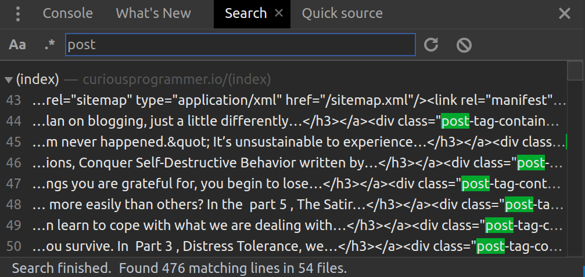
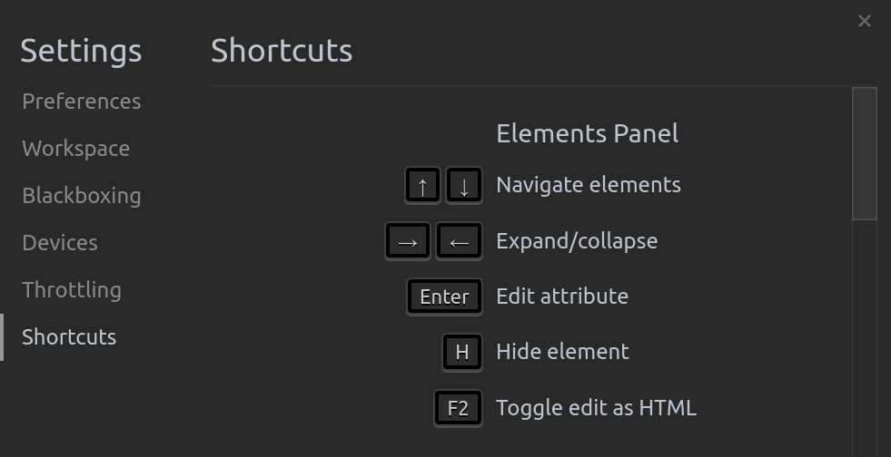
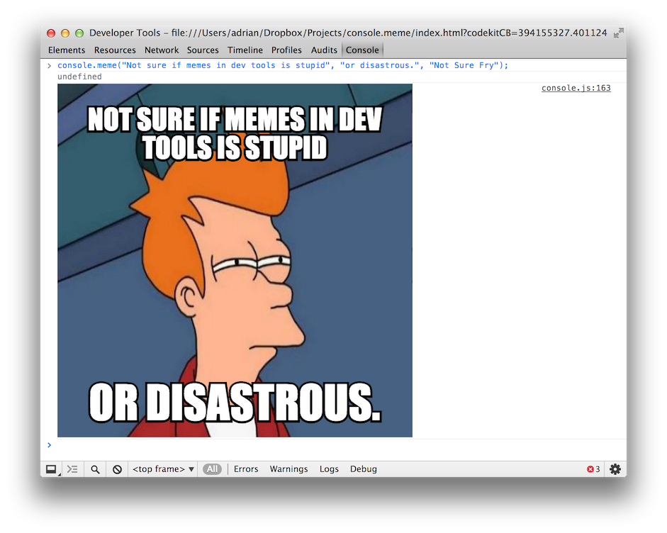

> Don't take your knowledge for granted. Share it. Someone could learn something new. It also helps you remember it. Keep a record of what you learn in a blog, memo or even a paperback book. Whatever you choose, jot it down and help your future self and others.

---

Features! It's all about the features. They make my life easier. 😄
There are so many unforgettable features. Here are the top few I want to document today. More to come in future posts and articles.

## First, my article
I got published on Offerzen with my article titled Quick front end bug-fixes. It's a good starting point for anyone familiarizing themselves with the tool.

> Debugging is an art form. Often, it feels like you need a series of serendipitous insights to fix a complicated bug. In reality, you need two things: technical knowledge to spot broader patterns and connections, and data on the bug itself to understand the problem.

<blockquote class="twitter-tweet" data-lang="en"><p lang="en" dir="ltr">Yay! After a lot of writing (and learning) and fun, my <a href="https://twitter.com/ChromeDevTools?ref_src=twsrc%5Etfw">@ChromeDevTools</a> article is published on <a href="https://twitter.com/OfferZen?ref_src=twsrc%5Etfw">@OfferZen</a>! This is my first technical article and I do focus on the basics but I hope you can learn a thing or two <a href="https://t.co/idrQKMZVew">https://t.co/idrQKMZVew</a>. Let me know what you think.</p>&mdash; Clarice Bouwer (@cbillowes) <a href="https://twitter.com/cbillowes/status/1020240152009019392?ref_src=twsrc%5Etfw">July 20, 2018</a></blockquote>

## What's new?
Chrome releases major updates automatically about every six weeks. As much as I love exploring and discovering on my own, Chrome offers a quick and easy way to get up to speed. They release a video with articles and these highlights are accessible directly within the tool. The **What's New** panel shows these highlights and I know of three ways to access it.

<div class="gif" alt="How to find out what is new in the Chrome DevTools">
    
    
    <a href="/images/gifs/chrome-devtools/whats-new-1.gif">
</div>

<a href="/images/gifs/chrome-devtools/whats-new.gif" target="_blank" nofollow><i>Open this gif in a new window</i></a>

1. Press `ESC` in any panel. The [drawer] (https://developers.google.com/web/tools/chrome-devtools/ui#drawer) will pop up. Simply click on the What's New panel in the drawer.

2. If you have lost the panel for some reason then resurrect it by clicking on the left side kebab button (it's like the hamburger but healthier). Click on the What's New menu item at the bottom of the menu.

3. Top right kebab button of the tool > More tools > What's New. *This menu has other nifty options so be sure to look into them.*


## Tips and Tricks by @flaviocopes

<blockquote class="twitter-tweet" data-lang="en"><p lang="en" dir="ltr">&quot;Cool Chrome DevTools tips and tricks you wish you knew already&quot; by <a href="https://twitter.com/flaviocopes?ref_src=twsrc%5Etfw">@flaviocopes</a><a href="https://t.co/G2ReQ7xrvw">https://t.co/G2ReQ7xrvw</a></p>&mdash; Chrome DevTools (@ChromeDevTools) <a href="https://twitter.com/ChromeDevTools/status/1019627868500955137?ref_src=twsrc%5Etfw">July 18, 2018</a></blockquote>

## The color picker

* Add a background or foreground color using the kebab button on a selector.
* Change the colors by using swatches, dragging bars, pasting colors...
* Use the color picker to pick colors from a web page.
* Undo all changes using `Command+Z` or `Ctrl+Z`.
* **Note:** In Chrome 67, [CSS variable](https://developer.mozilla.org/en-US/docs/Web/CSS/Using_CSS_variables) colors (`color: var(--main-color)`) now have color blocks / indicators next to them like normal colors would.

<div class="gif" alt="Using the built in color picker">
    
    
    <a href="/images/gifs/chrome-devtools/color-picker.gif">
</div>

## Backtracking and fast-forwarding
<blockquote class="twitter-tweet" data-lang="en"><p lang="en" dir="ltr">In <a href="https://twitter.com/ChromeDevTools?ref_src=twsrc%5Etfw">@ChromeDevTools</a>, if you&#39;ve made changes to elements and CSS, instead of refreshing to reset the page you can just undo using Ctrl+Z and redo using Ctrl+Y.</p>&mdash; Clarice Bouwer (@cbillowes) <a href="https://twitter.com/cbillowes/status/1018851449273380864?ref_src=twsrc%5Etfw">July 16, 2018</a></blockquote>

## JavaScript Snippets
If you need to run a repetitive script as a utility or debugging mechanism, you can save it as a snippet. Go to Sources > click on the show navigator button >> and select Snippets.

<div class="gif" alt="Create experimental or utility code using the Snippets">
    
    
    <a href="/images/gifs/chrome-devtools/snippets.gif">
</div>

I pasted the following code into my snippet.

```javascript
(function() {
    var greetings = ["Galaxy", "World", "Moon", "Exception"];
    greetings.map(function(greeting) {
        greet(greeting);
    });
})();

function greet (greet) {
    switch (greet) {
        case "World":
            console.log("Hello World!");
            break;
        case "Exception":
            throw ("Simulating that something went horribly wrong.")
        default:
            console.warn(`I want Hello World not Hello ${greet}.`);
    }
}
```

## Screenshots
Open the [Command Menu](https://developers.google.com/web/tools/chrome-devtools/ui#command-menu)
`Command+Shift+P` or `Ctrl+Shift+P` and type in screenshot.

* **Capture screenshot:** Screenshot the page as you see it.
* **Capture node screenshot:** Find an element you like and screenshot the node.
* **Capture full size screenshot:** Take a screenshot of how the entire page looks.

<div class="gif" alt="Taking screenshots of the screen and of a node">
    
    
    <a href="/images/gifs/chrome-devtools/screenshot.gif">
</div>


## Uber search across resources
Open the Search tab using `Command+Option+F` or `Ctrl+Shift+F` or access the drawer by pressing ESC, go to the kebab and click on search.



Type in what you are looking for and the tools will search through the text of all your your JavaScript, CSS and HTML files. Stop and think about this for a second. I was completely ecstatic when I found this by chance.

## :hover element
<blockquote class="twitter-tweet" data-lang="en"><p lang="en" dir="ltr">In <a href="https://twitter.com/ChromeDevTools?ref_src=twsrc%5Etfw">@ChromeDevTools</a> you can toggle the :hover element state to display it on the screen without having to hover over each time while inspecting the CSS. The same applies for active, focus, focus-within and visited. Neat hey! <a href="https://t.co/Em3dcjgpAI">pic.twitter.com/Em3dcjgpAI</a></p>&mdash; Clarice Bouwer (@cbillowes) <a href="https://twitter.com/cbillowes/status/1018852228399058944?ref_src=twsrc%5Etfw">July 16, 2018</a></blockquote>

## Shortcuts
I mention a few shortcuts. They are useful. The DevTools have many that you can learn in three ways.

1. By chance. Play mortal combat with your keyboard in the tools and you are bound to discover something cool.
2. Go to the settings from the main kebab > Settings > Shortcuts.
3. Access the [full list of DevTools keyboard shorcuts and gestures](https://developers.google.com/web/tools/chrome-devtools/shortcuts).



---
## Random!

[@adriancooney](https://github.com/adriancooney) created [console.image](https://github.com/adriancooney/console.image), "the one thing Chrome Dev Tools didn't need" - images in the console. It even supports gifs. ;-)

.

```js
console.meme(upper text, lower text, meme type|url, width, height)
console.meme("Not sure if memes in dev tools is stupid", "or disastrous.", "Not Sure Fry", 400, 300);
```