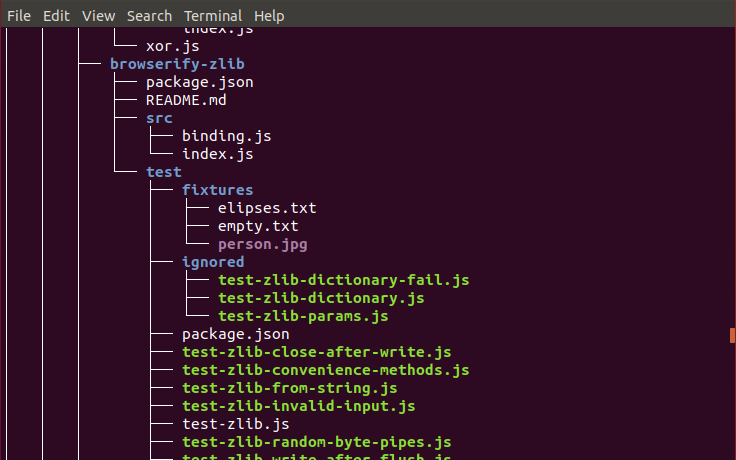
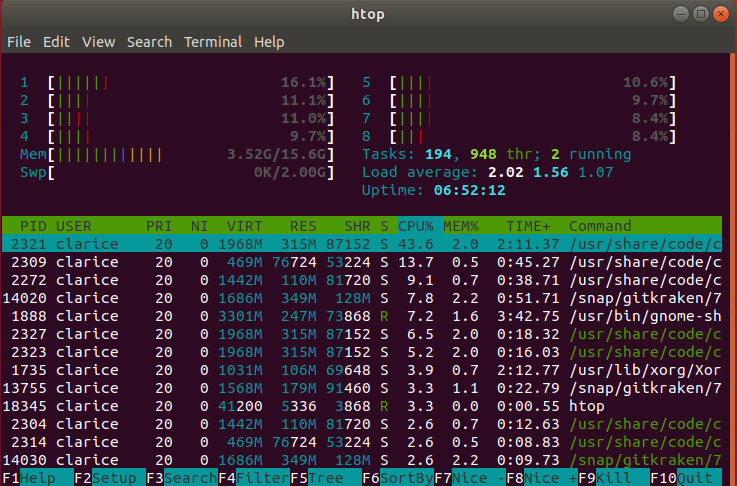

I have used Windows for over twenty years. Oh my goodness that's a long bloody time.

Now I've joined the Linux world. It's thrilling. I'm loving it, learning, sharing (and as always - documenting) what I love and learn.

---
**Ubuntu's APT** (Advanced Packaging Tool) gives you access to some cool software that you can install . Run `man apt` for all available options. [Examples](https://www.tecmint.com/useful-basic-commands-of-apt-get-and-apt-cache-for-package-management/) are always useful.

Want to know what you can download? `apt-cache search java | grep sdk-`

---
That brings me to **pipe** | Sheesh this thing is cool. It takes the output stream of the first command, sends it to the next command which does something radical with it, or maybe not, it depends on the command I guess and these commands can chain! Here are some [examples](https://www.geeksforgeeks.org/piping-in-unix-or-linux/).

```bash
# command_1 | command_2 | command_3 | .... | command_N
ls -a | more
sort awesome.txt | uniq
cat awesome.txt | head -7 | tail -5
cat awesome.txt | grep "value" | tree file2.txt | wc -lm
```

---
**tree** - It displays an indented directory tree. In your console. In color. So cool. I didn't have it installed by default so I installed it from apt.

```bash
apt-cache search "tree-"
sudo apt update
sudo apt install tree
```



---
**grep** - It stands for Global regular expression print and its an UBER plain-text search utility ` | grep <something to search for>`

```bash
apt-cache search java | grep sdk
man apt | grep update
ps -ef | grep zsh
cat /etc/hosts | grep 127
```

---
Copy **public key** after generating one.

* Add it to the `known_hosts` on a server so that you can [authenticate](https://security.stackexchange.com/questions/20706/what-is-the-difference-between-authorized-keys-and-known-hosts-file-for-ssh) to it.
* Add it to your repo for SSH authentication.

```bash
sudo apt install clipit # Send data to the clipboard
sudo apt install libcanberra-gtk-module libcanberra-gtk3-module # dependencies
ssh-keygen
cat ~/.ssh/id_rsa.pub | clipit
```

---
Get **system and distro information** - especially useful for online support.
```bash
$ lsb_release -a # (Linux Standard Base) - prints all distribution specific information

Distributor ID:	Ubuntu
Description:	Ubuntu 18.04 LTS
Release:	    18.04
Codename:	    bionic

$ lsb_release -a | grep 18.04

$ uname -a # prints all system information
Linux oxygen 4.15.0-29-generic #31-Ubuntu SMP Tue Jul 17 15:39:52 UTC 2018 x86_64 x86_64 x86_64 GNU/Linux
```

---
**htop** - its like **top** but hotter. It shows you processes. Interact with them by scrolling through them or selecting them. You can sort, tag, untag, trace, kill. [Options](https://www.howtogeek.com/howto/ubuntu/using-htop-to-monitor-system-processes-on-linux/)! It comes with options!



---
[**shutdown**](https://www.cyberciti.biz/faq/howto-shutdown-linux/) from the console.

```bash
sudo shutdown now # Shutdown now | /sbin/shutdown now
man shutdown
OPTIONS The following options are understood:

--helpq
    Print a short help text and exit.

-H, --halt
    Halt the machine.

-P, --poweroff
    Power-off the machine (the default).

-r, --reboot
    Reboot the machine.
```

---
* **whoami** prints the effective user name.
* Check user roles:
  ```bash
  cat /etc/passwd | grep clarice:x:1 # admin
  cat /etc/passwd | grep root:x:0 # root
  ```

---
**chmod** changes the file mode bits so you can set a file to read-only, executable and so forth.

```bash
sudo chmod +x awesome.sh # executable
./awesome.sh # open in that directory
/path/to/awesome.sh # open from another directory
```

---
`sudo nautilus` opens the file manager in admin mode giving me uber rights like being able to create folders and other admin stuff I am yet to explore.

This is dangerous territory so tread with caution.

---
Chromium is on the Ubuntu Software centre, but **Chrome** is not. Download it from their website. I needed flash and it only worked when I installed Chrome.

I installed [oh-my-zsh](https://github.com/robbyrussell/oh-my-zsh) for a better shell experience. Settings are found in **~/.zshrc**

```bash
ZSH_THEME="powerlevel9k/powerlevel9k"
POWERLEVEL9K_LEFT_PROMPT_ELEMENTS=(context dir rbenv vcs)
POWERLEVEL9K_RIGHT_PROMPT_ELEMENTS=(status root_indicator background_jobs history)
POWERLEVEL9K_SHORTEN_DIR_LENGTH=2
POWERLEVEL9K_SHOW_CHANGESET=true
POWERLEVEL9K_MODE='awesome-fontconfig'
POWERLEVEL9K_SHORTEN_DIR_LENGTH=1
POWERLEVEL9K_SHORTEN_STRATEGY=truncate_from_right_
POWERLEVEL9K_VCS_HIDE_TAGS=true
POWERLEVEL9K_SHOW_CHANGESET=true
POWERLEVEL9K_VCS_SHORTEN_LENGTH=10
POWERLEVEL9K_VCS_SHORTEN_MIN_LENGTH=11
POWERLEVEL9K_VCS_SHORTEN_STRATEGY="truncate_from_right"
POWERLEVEL9K_VCS_SHORTEN_DELIMITER=".."
POWERLEVEL9K_RIGHT_PROMPT_ELEMENTS=(status)

export NVM_DIR="$HOME/.nvm"
[ -s "$NVM_DIR/nvm.sh" ] && \. "$NVM_DIR/nvm.sh"  # This loads nvm
[ -s "$NVM_DIR/bash_completion" ] && \. "$NVM_DIR/bash_completion"  # This loads nvm bash_completion

# place this after nvm initialization!
autoload -U add-zsh-hook
load-nvmrc() {
  local node_version="$(nvm version)"
  local nvmrc_path="$(nvm_find_nvmrc)"

  if [ -n "$nvmrc_path" ]; then
    local nvmrc_node_version=$(nvm version "$(cat "${nvmrc_path}")")

    if [ "$nvmrc_node_version" = "N/A" ]; then
      nvm install
    elif [ "$nvmrc_node_version" != "$node_version" ]; then
      nvm use
    fi
  elif [ "$node_version" != "$(nvm version default)" ]; then
    echo "Reverting to nvm default version"
    nvm use default
  fi
}

```

---
**Freaking sound!** If I ever lose my sound card association again - because that happened 😢 - I can test my sound using `aplay /usr/share/sounds/alsa/Front_Center.wav` then install a bunch of [drivers] (
https://help.ubuntu.com/community/SoundTroubleshootingProcedure)

```bash
sudo apt-get update;
sudo apt-get dist-upgrade;
sudo apt-get install pavucontrol linux-sound-base alsa-base alsa-utils lightdm ubuntu-desktop  linux-image-`uname -r` libasound2;
sudo apt-get -y --reinstall install linux-sound-base alsa-base alsa-utils lightdm ubuntu-desktop  linux-image-`uname -r` libasound2;
killall pulseaudio;
rm -r ~/.pulse*;
ubuntu-support-status;
sudo usermod -aG

cat /etc/group | grep -e '^pulse:' -e '^audio:' -e '^pulse-access:' -e '^pulse-rt:' -e '^video:' | awk -F: '{print $1}' | tr '\n' ',' | sed 's:,$::g'

whoami
```

---
I got to play around with Linux on a [Rock64](/blog/building-a-monitoring-display-with-a-rock-64). So much fun!

---

<blockquote class="twitter-tweet" data-lang="en"><p lang="en" dir="ltr">Playing around to get a monitoring display set up on a Rock64 device <a href="https://twitter.com/cloudafrica?ref_src=twsrc%5Etfw">@cloudafrica</a> <a href="https://t.co/TQ0gXEiFzi">pic.twitter.com/TQ0gXEiFzi</a></p>&mdash; Clarice Bouwer (@cbillowes) <a href="https://twitter.com/cbillowes/status/1014845132418543620?ref_src=twsrc%5Etfw">July 5, 2018</a></blockquote>

<blockquote class="twitter-tweet" data-lang="en"><p lang="en" dir="ltr">I can get used to using htop! sudo apt-get install htop or use Do Not Forget (rather Dandified YUM) on Fedora ;) sudo dnf htop. It`s an uber top. <a href="https://t.co/JrmuwcguJH">https://t.co/JrmuwcguJH</a> <a href="https://t.co/HP1fggrTdH">pic.twitter.com/HP1fggrTdH</a></p>&mdash; Clarice Bouwer (@cbillowes) <a href="https://twitter.com/cbillowes/status/1016295624055099393?ref_src=twsrc%5Etfw">July 9, 2018</a></blockquote>

<blockquote class="twitter-tweet" data-lang="en"><p lang="en" dir="ltr">In Linux the &amp; makes the command run in the background. I never knew that until last week.</p>&mdash; Clarice Bouwer (@cbillowes) <a href="https://twitter.com/cbillowes/status/1016293686555136000?ref_src=twsrc%5Etfw">July 9, 2018</a></blockquote>

<blockquote class="twitter-tweet" data-lang="en"><p lang="en" dir="ltr">How To Install and Secure Memcached on Ubuntu 16.04 <a href="https://t.co/TldVw1TCmf">https://t.co/TldVw1TCmf</a></p>&mdash; Clarice Bouwer (@cbillowes) <a href="https://twitter.com/cbillowes/status/1018109554121412609?ref_src=twsrc%5Etfw">July 14, 2018</a></blockquote>
