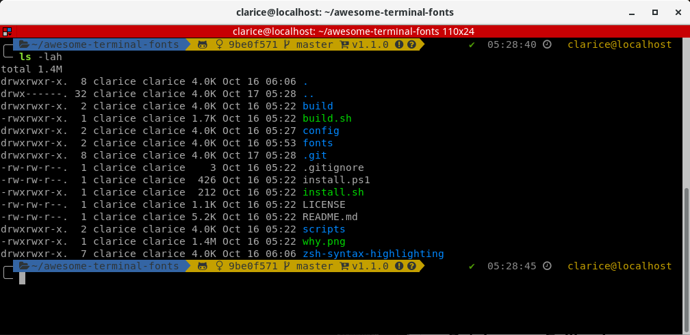
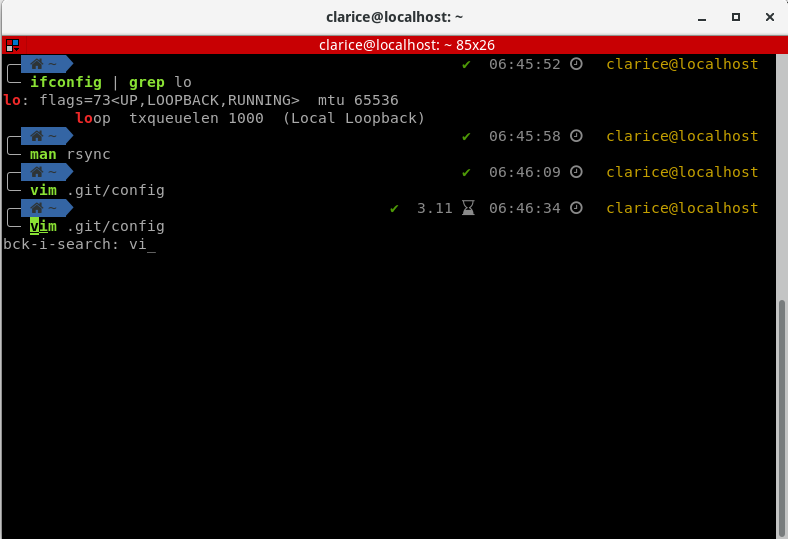

I had to [re-install](/blog/setting-up-my-environment-in-fedora) so I documented my process.
In this post, I focus on configuring my shell for a personalized experience.

---

## Install Oh My Zsh

zsh is an interactive shell with many [features](https://github.com/hmml/awesome-zsh)
that improve the command line experience. Oh My Zsh is a very popular plugin framework for zsh
which comes with its own set of plugins and themes.

zsh installation [instructions](https://gist.github.com/derhuerst/12a1558a4b408b3b2b6e) are simple.
Below are the Red Hat-based linux system instructions.

```bash
sudo yum upgrade
sudo yum install zsh
zsh --version
which zsh
```

[Oh My Zsh](https://github.com/robbyrussell/oh-my-zsh) works best on Linux and MacOS and can be installed using `curl` or `wget`.

```bash
sh -c "$(curl -fsSL https://raw.githubusercontent.com/robbyrussell/oh-my-zsh/master/tools/install.sh)"
#or
sh -c "$(wget https://raw.githubusercontent.com/robbyrussell/oh-my-zsh/master/tools/install.sh -O -)"
```

## Install the `powerlevel9k` theme

I love this [theme](https://github.com/bhilburn/powerlevel9k). All you have to do is clone the repo
to your `.oh-my-zsh` custom themes directory and edit the `~/.zshrc` file.

```bash
git clone https://github.com/bhilburn/powerlevel9k.git ~/.oh-my-zsh/custom/themes/powerlevel9k

vim ~/.zshrc
ZSH_THEME="powerlevel9k/powerlevel9k"
```

## Install fonts

[Powerline fonts](https://github.com/powerline/fonts) are pre-patched and adjusted fonts that are used with the Powerline statusline plugin.

``` bash
sudo dnf -y install powerline-fonts
```

[Fira Code](https://github.com/tonsky/FiraCode) gives you a monospaced font with programming ligatures.
I now use this font in IntelliJ and VS Code.

```bash
sudo dnf -y copr enable evana/fira-code-fonts
sudo dnf -y install -y fira-code-fonts
```

To display nifty symbols in the statusline, I use [awesome terminal fonts](https://github.com/gabrielelana/awesome-terminal-fonts).

```bash
git clone https://github.com/gabrielelana/awesome-terminal-fonts.git
cd awesome-terminal-fonts
cp -r ./build ~/.fonts
fc-cache -fv ~/.fonts
```

```bash
vim config/10-symbols.conf
# PragmataPro => choose a filename from the .build directory.
# I chose fontawesome-regular.
```

```bash
cp config/10-symbols.conf ~/.config/fontconfig/conf.d
# You may need to create this directory
```

```bash
vim ~/.zshrc

ZSH_THEME="powerlevel9k/powerlevel9k"
POWERLEVEL9K_MODE='awesome-fontconfig'

# Add to the bottom of the file
source ~/.fonts/*.sh
```

```bash
rm -rf awesome-terminal-fonts
```

## Customize `oh-my-zsh`



```bash
ZSH_THEME="powerlevel9k/powerlevel9k"
POWERLEVEL9K_MODE="awesome-fontconfig"
POWERLEVEL9K_PROMPT_ON_NEWLINE=true
POWERLEVEL9K_LEFT_PROMPT_ELEMENTS=(dir vcs)
POWERLEVEL9K_RIGHT_PROMPT_ELEMENTS=(status background_jobs command_execution_time time context)
POWERLEVEL9K_SHORTEN_DIR_LENGTH=1
POWERLEVEL9K_SHORTEN_DELIMITER=""
POWERLEVEL9K_SHORTEN_STRATEGY="truncate_from_right"
POWERLEVEL9K_SHOW_CHANGESET=true
POWERLEVEL9K_CHANGESET_HASH_LENGTH=8

POWERLEVEL9K_RIGHT_SEGMENT_SEPARATOR=''
POWERLEVEL9K_RIGHT_SUBSEGMENT_SEPARATOR=''

POWERLEVEL9K_TIME_FOREGROUND='245'
POWERLEVEL9K_COMMAND_EXECUTION_TIME_FOREGROUND='245'
POWERLEVEL9K_STATUS_OK_FOREGROUND='green'
POWERLEVEL9k_STATUS_ERROR_FOREGROUND='red'
POWERLEVEL9k_STATUS_ERROR_FOREGROUND='red'

POWERLEVEL9K_TIME_BACKGROUND='clear'
POWERLEVEL9K_COMMAND_EXECUTION_TIME_BACKGROUND='clear'
POWERLEVEL9K_STATUS_OK_BACKGROUND='clear'
POWERLEVEL9K_STATUS_ERROR_BACKGROUND='clear'
POWERLEVEL9K_STATUS_ERROR_BACKGROUND='clear'
POWERLEVEL9K_CONTEXT_DEFAULT_BACKGROUND='clear'
```

## `zsh-syntax-highlighting` plugin

This [plugin](https://github.com/zsh-users/zsh-syntax-highlighting) highlights commands while typing into an interactive terminal.



```bash
git clone https://github.com/zsh-users/zsh-syntax-highlighting.git
echo "source ${(q-)PWD}/zsh-syntax-highlighting/zsh-syntax-highlighting.zsh" >> ${ZDOTDIR:-$HOME}/.zshrc

vim ~/.zshrc

plugins=(
  ...
  zsh-syntax-highlighting
  ...
)

# Right at the bottom of the file
source ~/.oh-my-zsh/custom/plugins/zsh-syntax-highlighting

ZSH_HIGHLIGHT_HIGHLIGHTERS=(main brackets pattern cursor)
ZSH_HIGHLIGHT_STYLES[cursor]='bold'

ZSH_HIGHLIGHT_STYLES[alias]='fg=green,bold'
ZSH_HIGHLIGHT_STYLES[suffix-alias]='fg=green,bold'
ZSH_HIGHLIGHT_STYLES[builtin]='fg=green,bold'
ZSH_HIGHLIGHT_STYLES[function]='fg=green,bold'
ZSH_HIGHLIGHT_STYLES[command]='fg=green,bold'
ZSH_HIGHLIGHT_STYLES[precommand]='fg=green,bold'
ZSH_HIGHLIGHT_STYLES[hashed-command]='fg=green,bold'
```

## `zsh-autosuggestions` plugin

This [plugin](https://github.com/zsh-users/zsh-autosuggestions) suggests commands as you type based on the command history.

```bash
git clone https://github.com/zsh-users/zsh-autosuggestions ${ZSH_CUSTOM:-~/.oh-my-zsh/custom}/plugins/zsh-autosuggestions

vim ~/.zshrc
plugins=(
  ...
  zsh-autosuggestions
  ...
)
```

## Other plugins

```bash
# Which plugins would you like to load?
# Standard plugins can be found in ~/.oh-my-zsh/plugins/*
# Custom plugins may be added to ~/.oh-my-zsh/custom/plugins/
# Example format: plugins=(rails git textmate ruby lighthouse)
# Add wisely, as too many plugins slow down shell startup.
plugins=(
  git
  zsh-syntax-highlighting
  zsh-autosuggestions
  history
  last-working-dir
  lein
)
```

For more plugins, check out [awesome-zsh-plugins](https://github.com/unixorn/awesome-zsh-plugins).