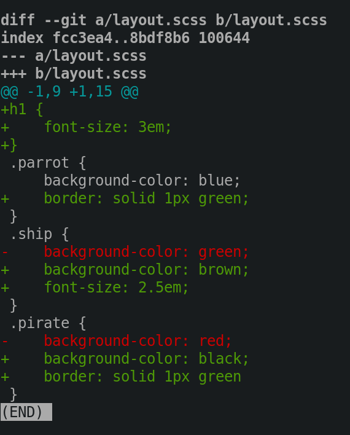
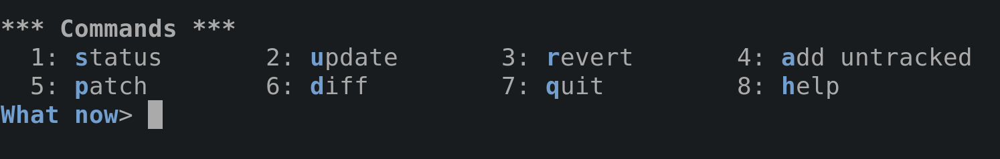

Small, atomic commits makes it easier for code reviews, browsing
the history and reverting changes. Life happens and commits can
touch more lines and files than I want but the changes committed
should be distinct. *"Don't mix your apples with your toaster."*

> TL;DR: Use `git add -i` or `git add -p`. Stage the files you know
> are related. Break other mangled changes in files into smaller
> chunks (known as **hunks**) using patch mode. Stage. Commit. Do
> it again. **Be careful.**

In this post I am going to show you how to craft your changes into
small atomic commits. This means that you are going to break up
your changes into separate pieces of work and commit them.

## Let's get things straight

It was brought to my attention in
[Reddit](https://www.reddit.com/r/programming/comments/agxi5o/how_to_craft_your_changes_into_small_atomic/)
by WetDynamics that "atomic commits sound nice in theory but in
practice you end up with 100 commits of "extracted foo into a
method" or "refactored bar to make it more readable". Does it
really make your git history easier to grok than a single commit
focused on a feature?" So I
[wrote](/blog/why-i-create-atomic-commits-in-git)
about it.

## Stop!
Know what you are doing. If you make a mistake by omitting a file
or leaving out a chunk of a file you will have a broken commit.

Doing this is much easier when you keep your changes as small and
simple as possible. Although you can scale up, the more complex
your changes are, the more your brain has to work and the larger
the chances are of you making a mistake.

## Approaches

There are multiple ways to breakdown changes into smaller commits:

**The not so cool way**
1. Commit the files that are related. Make a copy of the file with
multiple changes, revert the other changes in the file, add the new
changes to the file and commit it. Put your changes back for the
next commit. No more stone age processes. :smile:

**The Git way**
1. You can use the interactive mode approach to add the files you
want and choose parts of the files you are interested in committing.
2. You can use the patch approach directly.

## Getting started

`git diff layout.scss` will give you the diff for that file. You
will notice some seriously stylish changes that I have made.



Quickly check the status of the file in `git status` and see that
it is already **staged**. This file must not be committed in its
entirety so the file must not be staged.

```example
➜  ahoy git:master ✗ 9cc08bf ➜ git status
On branch master
Changes to be committed:
  (use "git reset HEAD <file>..." to unstage)

	renamed:    data/ship.json -> data/ships.json
	modified:   layout.scss
	modified:   src/pirate.clj
    modified:   components/parrot.jsx
```

## Crafting atomic changes

This is the meat of what I want to share with you. I am going to
show you how to stage files and parts of files to craft your
commits. :sunglasses:

### The interactive mode way
Get started with `git add -i` or `git add --interactive` See a
status screen which is like `git status` on steroids.

 * To the left you have staged changes. If the file hasn't been
 staged yet it will display **unchanged**.

* To your right you have unstaged changes. If the file is fully
staged then it will display **nothing**.

```example
➜  ahoy git:master ✗ 9cc08bf ➜ git add -i
           staged     unstaged path
  1:       +0/-12      nothing data/ship.json
  2:       +16/-0      nothing data/ships.json
  3:        +8/-2      nothing layout.scss
  4:        +4/-4      nothing src/pirate.clj
  5:    unchanged        +2/-2 components/parrot.jsx
```

You are presented with a bunch of options that will aid you on
your journey. Let's take a look at them:


`What now>` is the base prompt patiently awaiting your commands.
Type in any of the numbers or letters below:

1. `1` or `s` to see the steroid status screen again

2. `2` or `u` lets you stage files. When you select it, it will
   show files that have not been staged. This is equivalent to `git add <file>`
   * If there are none you will stay in the `What Now>` prompt. If there
     are files to be staged then you will enter the `Update>>` prompt.
   * Enter the numbers of the files or the highlighted letters and press
    `ENTER`. The files are shown again. This time you will notice asterisks
    next to the files you have selected. They are the one's that will be staged.
   * Rinse and repeat this process until you are happy with the files you want to stage.
   * Press `ENTER` to stage the files.
   * If you want to quit this mode, just press `ENTER`

3. `3` or `r` will do the opposite of update. It will unstage (or revert)
   your changed file. This is equivalent to `git rm --cached <file>` The process
   is exactly the same as above except you will be in the `Revert>>` prompt.

4. `4` or `a` will add any untracked files. Again, the process is the same but
   you will be in the `Add untracked>>` prompt. This initiates a `git add <file>`

5. `5` or `p` will allow us to selectively choose parts of a file (known as **hunks**)
   and stage just that part. You will be in the `Patch update>>` prompt. Same story
   as before. I'll get to this in a bit.

6. `6` or `d` will diff any **staged** file. Again it is the same above but now you
   will be in the `Review diff>>` prompt and you will be seeing diffs for staged
   files as you would in `git diff --cached <file>`

### Patch update mode
You are presented with hunks. The `layout.scss` file below only has one hunk.
Uh, not ideal because I want to break it up into atomic commits.

```diff
Patch update>>
diff --git a/layout.scss b/layout.scss
index fcc3ea4..8bdf8b6 100644
--- a/layout.scss
+++ b/layout.scss
@@ -1,9 +1,15 @@
+h1 {
+    font-size: 3em;
+}
 .parrot {
     background-color: blue;
+    border: solid 1px green;
 }
 .ship {
-    background-color: green;
+    background-color: brown;
+    font-size: 2.5em;
 }
 .pirate {
-    background-color: red;
+    background-color: black;
+    border: solid 1px green
 }
Stage this hunk [y,n,q,a,d,s,e,?]?
```
Ahoy matey, there be options:

```example
y - stage this hunk
n - do not stage this hunk
q - quit; do not stage this hunk or any of the remaining ones
a - stage this hunk and all later hunks in the file
d - do not stage this hunk or any of the later hunks in the file
s - split the current hunk into smaller hunks <-----Booya!
e - manually edit the current hunk
? - print help
```

Press `s` to split that hunk into baby hunks. Now there are more options

```example
Stage this hunk [y,n,q,a,d,K,g,/,e,?]?
...
g - select a hunk to go to
/ - search for a hunk matching the given regex
K - leave this hunk undecided, see previous hunk
...
```

Git was able to split that file into **4 hunks** which you can choose to stage
or not. Stage the ones that are relevant to your commit and leave the rest for
now. You won't lose those changes.

**Hunk #1**
```diff
@@ -1,2 +1,5 @@
+h1 {
+    font-size: 3em;
+}
 .parrot {
     background-color: blue;
```
**Hunk #2**
```diff
@@ -1,4 +4,5 @@
 .parrot {
     background-color: blue;
+    border: solid 1px green;
 }
 .ship {
```
**Hunk #3**
```diff
@@ -3,5 +7,6 @@
 }
 .ship {
-    background-color: green;
+    background-color: brown;
+    font-size: 2.5em;
 }
 .pirate {
```
**Hunk #4**
```diff
@@ -6,4 +11,5 @@
 }
 .pirate {
-    background-color: red;
+    background-color: black;
+    border: solid 1px green
 }
```

When a hunk cannot be split you will see the following in
which can you can edit the hunk.

```diff
Sorry, cannot split this hunk
@@ -9,4 +9,8 @@
     "pirate": "Sailor Tom the Plank",
     "parrot": "Major Idea"
   }
+  {
+    "ship": "Mother Octopus",
+    "pirate": "Pi",
+    "parrot": "Log"
 ]
```

> This @@ -1,9 +1,11 @@ line specifies the boundaries of the hunk to change.
The -1,9 means the original portion of code started at line 1 in the code
below and went for 9 more lines. The +1,11 means that we want to replace the
original portion with the following code starting at line 1 and spanning the
next 11 lines. ~
[http://blog.jimbaca.com](http://blog.jimbaca.com/manually-edit-git-hunks-to-stage/)

To wrap it up, select the related files and create the related hunks. Stage
them. Quit and commit. Do it again for the next change.

## The Git patch way
You can also use git patch directly. `bash±git add -p` or
`bash±git add --patch` will take you into patch mode.

* reset files `bash±git reset --patch`
* checkout out parts of files `bash±git checkout --patch`
* stash parts of files `bash±git stash save --patch`

## References

* [7.2 Git Tools - Interactive Staging](https://git-scm.com/book/en/v2/Git-Tools-Interactive-Staging) -
  git-scm.com
* [How to undo 'git add' before commit?](https://stackoverflow.com/questions/348170/how-to-undo-git-add-before-commit)
