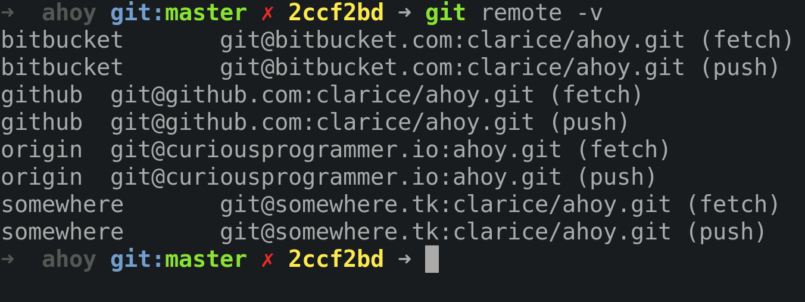
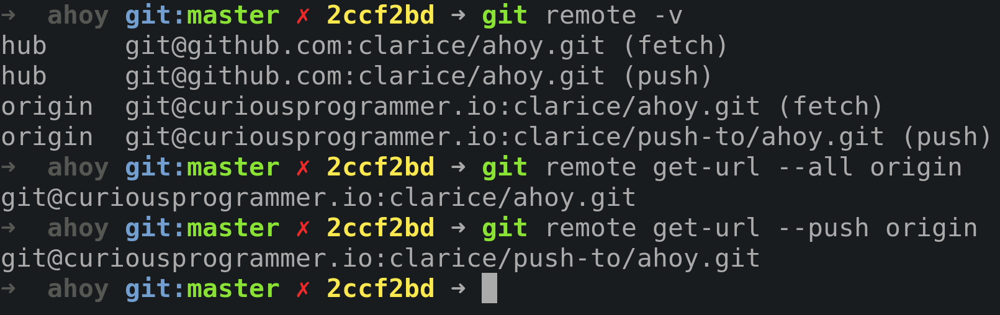

I have a repository with two remotes. **origin** is my personal repository
and **bitbucket** is by BitBucket repository. The nugget of this post is
to push to both branches in [one command](#all-remotes).

> The git remote command lets you create, view, and delete connections to other
> repositories. Remote connections are more like bookmarks rather than direct
> links into other repositories. Instead of providing real-time access to
> another repository, they serve as convenient names that can be used to
> reference a not-so-convenient URL. ~
> [Atlassian](https://www.atlassian.com/git/tutorials/syncing)

---

This post forms part of a sequence of command line references that I
will be writing where I forget the command or its syntax or find it
interesting enough to document it.

Although it's Google-able, there are a chain of
commands that I want kept together for ease of use.

The commands I use should be universal but in case it's necessary, **I am
running Fedora release 28 (Twenty Eight) and Zsh.**

> Also, if you want to contribute something interesting in any of
> my posts, please create a
> [pull-request](https://github.com/cbillowes/curious-programmer-helium)
> or write a comment below. :smile:

---
## Cheat Sheet

### View
Verbose output. Fetch and push URLs for each remote.
```bash
git remote -v
```



URLs for the remote. `--all` and `--push` switches available.
```bash
git remote get-url <name>
```
example:
`git remote get-url --all origin`
`git remote get-url --push origin`



Get information about remote.
```bash
git remote show origin
```

```example
* remote origin
  Fetch URL: git@github.com:clarice/ahoy.git
  Push  URL: git@github.com:clarice/ahoy.git
  HEAD branch: master
  Remote branch:
    master tracked
  Local branch configured for 'git pull':
    master merges with remote master
  Local ref configured for 'git push':
    master pushes to master (up to date)
```

### Create
Create a new remote.
```bash
git remote add <name> <url>
```
example: `git remote add another git@another.com:clarice/ahoy.git`

Add a remote that tracks selected branches.
```bash
git remote add -f -t <branch> -m <branch> origin git@another.com/clarice/ahoy.git
```
example: `git remote add -f -t <branch> -m <branch> origin git@another.com/clarice/ahoy.git`

### Remove
Remote-tracking branches and configuration settings are removed.
```bash
git remote rm <name>
```
example: `git remote remove another`

Deletes stale references associated with remote.
```bash
git remote prune <name> --dry-run
```
example: `git remote prune origin --dry-run`

### Push

#### Single remote
Push local changes to a remote.
```bash
git push <remote> <branch>
```
example: `git remote push another`

#### All remotes

##### All branches
Push local changes to all remotes.
```bash
git remote | xargs -L1 git push --all
```

##### Specific branch
Push local changes for a specific branch to all remotes.
```bash
git remote | xargs -L1 -I R git push R <branch>
```
example: `git remote | xargs -L1 -I R git push R master`

##### Create an alias
Create an alias to push local changes to all remotes for all branches.
```bash
git config --global alias.pushall '!git remote | xargs -L1 git push --all'
```

### Edit

#### Rename
Rename remote. All remote-tracking branches and configuration settings for the remote
are updated.
``` bash
git remote rename <old-name> <new-name>
```
example: `git remote rename github hub`

#### Change URLs
Set a new URL for the remote. `--push`, `--add` and `--delete` switches
are available.
```bash
git remote --push set-url <name> <url>
```
example:
`git remote set-url --push origin git@github.com:clarice/ahoy.com`

## References

- [git-scm](https://git-scm.com/docs/git-remote)
- [Git Syncing](https://www.atlassian.com/git/tutorials/syncing)
- [Able to push to all git remotes with the one command?](https://stackoverflow.com/questions/5785549/able-to-push-to-all-git-remotes-with-the-one-command)
- [Wallpaper](https://wall.alphacoders.com/big.php?i=430944)
